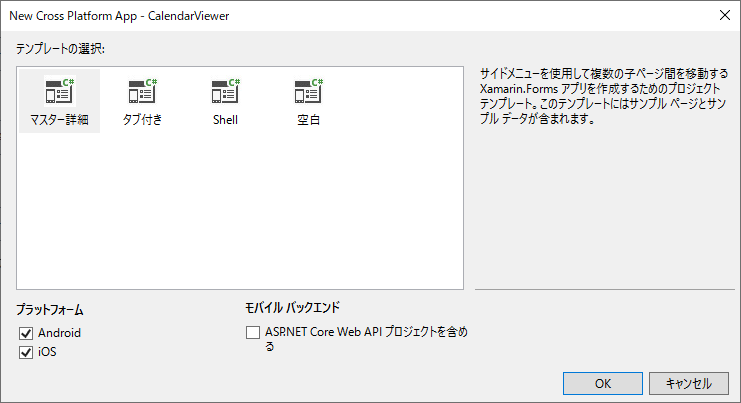
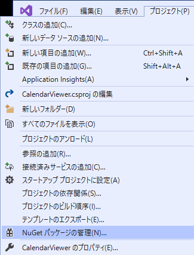
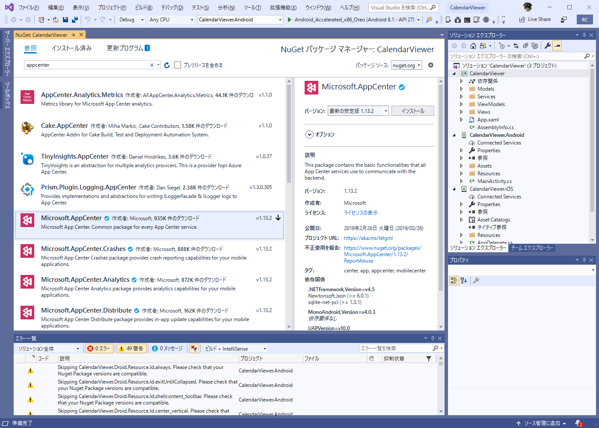
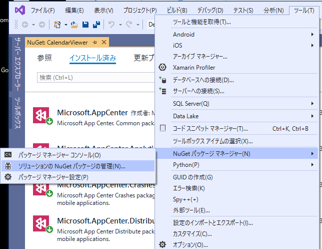
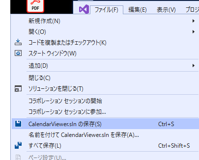

# App Centerの導入

## アカウントの作成

App Centerのアカウント作成は、[https://appcenter.ms/create-account](https://appcenter.ms/create-account)
より行います。App Centerのアカウントの認証は、以下のサービスのアカウントを用いて行います。

- Microsoftアカウント
- GitHub
- Facebook
- Google

ここでは、GitHubアカウントでのアカウント作成について説明します。


- GitHubでのアカウント作成


## 

App Centerのビルドは、以下のスースコード管理に対応しています。

- Azure DevOps
- GitHub
- Bitbucket

いずれもクラウドサービス上のGitレポジトリーです。

## GitHub Appsの導入と


# Projectの作成


<div class="column">

### アプリケーションのURLは変更不可

App Centerは、アプリケーションの作成後、アプリケーションの名称は画面から変更することができますが、
アプリケーションに対するApp Center上でのURLは変更することができません。

URLを変更したい場合は、App Center上でのアプリケーションを一度削除した後、再作成することになります。

</div>


登録

https://appcenter.ms/create-account


## AppCenterからのプロジェクト作成


## プロジェクトの作成

Visual StudioでXamarin.Formsのプロジェクトを作成します。

メニューバーの「ファイル」→「新規作成」→「プロジェクト」を選択します。

プロジェクトの候補から「Cross-Platform」を選択し、モバイルアプリ(Xamarin.Forms)を選択します。([@fig:img_045_100_image])

{#fig:img_045_100_image}

プロジェクト名を入力します。本書では、以下プロジェクト名として「CalendarViewer」を使用します。

{#fig:img_045_105_image}

続いて、テンプレートから「Master-Detail」を選択します。([@fig:img_045_110_image])

{#fig:img_045_110_image}

プロジェクトが作成されたら、ソリューションをバージョン管理に追加します。メニューバーの「ファイル」→「ソース管理」を選択します。([@fig:img_045_115_image])

{#fig:img_045_115_image}

なお、Visual Studio2017では、このメニューはプロジェクト作成時の「新しいGitリポジトリの作成」のオプションの箇所にあります。([@fig:img_045_116_image])

{#fig:img_045_116_image}

<div class="column">

### Xamarin.Formsのソリューション名の制約

Visual Studio For Macでは、`-`または`_`を含むソリューション名で作成したXamarin.Formsのプロジェクトを読み込むと、Androidプロジェクトの
`MainActivity.cs`で`The type or namespace name 'App' could not be found `というコンパイルエラーが発生する問題があります。<span class="footnote">[https://stackoverflow.com/a/52317040](https://stackoverflow.com/a/52317040)</span>この問題を回避するためには、
プロジェクト作成時の「新しいプロジェクト」画面で、`-`または`_`を含まない名前でプロジェクトを作成します。

</div>

## AppCenterの導入

## App Centerのパッケージの導入

App Centerでの以下の機能を使用するには、Microsoftが提供するSDKをソリューションに
導入する必要があります。

- クラッシュレポート
- アプリ内更新
- プッシュ通知

SDKは以下のNuGetパッケージの形式で提供されています。

- Microsoft.AppCenter
- Microsoft.AppCenter.Analytics
- Microsoft.AppCenter.Crashes
- Microsoft.AppCenter.Distribute
- 

<div class="column">

### App CenterのSDKはオープンソースです

App Centerで提供される各種のツールはオープンソースで開発が進められています。

App CenterのSDKは以下のGitHubレポジトリーで公開されています。

- [https://github.com/Microsoft/AppCenter-SDK-DotNet](https://github.com/Microsoft/AppCenter-SDK-DotNet)
- [https://github.com/Microsoft/AppCenter-SDK-Apple](https://github.com/Microsoft/AppCenter-SDK-Apple)
- [https://github.com/Microsoft/AppCenter-SDK-Android](https://github.com/Microsoft/AppCenter-SDK-Android)
- [https://github.com/Microsoft/AppCenter-SDK-React-Native](https://github.com/Microsoft/AppCenter-SDK-React-Native)

</div>

以下、Visual Studio 2017でのSDKの導入手順を説明します。

メニューバーの「プロジェクト」→「NuGetパッケージの管理」を選択します。({@fig:img_120_image})

{#fig:img_120_image}

テキストボックスに「appcenter」と入力して、Microsoft.AppCenterを選択して「インストール」を選択します。({@fig:img_130_image})

{#fig:img_130_image}

ライセンスの内容を確認し、「同意する」を選択します。

{#fig:img_140_image}

ライセンスに同意すると、Microsoft.AppCenterのパッケージをVisual Studioがダウンロードし、端末にインストールされます。

以下のパッケージについて、同様にNuGetパッケージをインストールします。

- Microsoft.AppCenter.Analytics
- Microsoft.AppCenter.Crashes
- Microsoft.AppCenter.Distribute

続いて、ソリューションにNuGetパッケージを設定します。

メニューバーの、「ツール」→「NuGetパッケージマネージャー」→「ソリューションのNuGetパッケージの管理」を選択します。({@fig:img_150_image})

{#fig:img_150_image}

「インストール済み」の項目の「Microsoft.AppCenter」を選択します。
画面右側の「プロジェクト」の右側のチェックボックスにチェックを入れて、全てのプロジェクトを選択状態にし、「インストール」を選択します。({@fig:img_160_image})

{#fig:img_160_image}

ライセンスへの同意を確認し、「同意する」を選択します。({@fig:img_170_image})

{#fig:img_170_image}

メニューバーの「ファイル」から「(ソリューション名).slnの保存」を選択します。({@fig:img_180_image})

{#fig:img_180_image}

この状態でコマンドプロンプト等から`git status`コマンドで状態を確認すると、
以下のファイルが編集され、SDKのインストールが設定されています。

- CalendarViewer/CalendarViewer.Android/CalendarViewer.Android.csproj
- CalendarViewer/CalendarViewer.iOS/CalendarViewer.iOS.csproj
- CalendarViewer/CalendarViewer/CalendarViewer.csproj


```
> git status
On branch master
Changes not staged for commit:
  (use "git add <file>..." to update what will be committed)
  (use "git checkout -- <file>..." to discard changes in working directory)

        modified:   CalendarViewer/CalendarViewer.Android/CalendarViewer.Android.csproj
        modified:   CalendarViewer/CalendarViewer.iOS/CalendarViewer.iOS.csproj
        modified:   CalendarViewer/CalendarViewer/CalendarViewer.csproj
```

`git diff`コマンドで編集内容を確認すると、以下の様になっています。

```

azusa@SOYOKAZE C:\Users\azusa\source\repos\CalendarViewer [master +0 ~3 -0]
> git diff
diff --git a/CalendarViewer/CalendarViewer.Android/CalendarViewer.Android.csproj b/CalendarViewer/CalendarViewer.Android/CalendarViewer.Android.csproj
index 66dbab1..4ecc35e 100644
--- a/CalendarViewer/CalendarViewer.Android/CalendarViewer.Android.csproj
+++ b/CalendarViewer/CalendarViewer.Android/CalendarViewer.Android.csproj
@@ -52,6 +52,18 @@
     <Reference Include="System.Xml" />
   </ItemGroup>
   <ItemGroup>
+    <PackageReference Include="Microsoft.AppCenter">
+      <Version>1.13.2</Version>
+    </PackageReference>
+    <PackageReference Include="Microsoft.AppCenter.Analytics">
+      <Version>1.13.2</Version>
+    </PackageReference>
+    <PackageReference Include="Microsoft.AppCenter.Crashes">
+      <Version>1.13.2</Version>
+    </PackageReference>
+    <PackageReference Include="Microsoft.AppCenter.Distribute">
+      <Version>1.13.2</Version>
+    </PackageReference>
     <PackageReference Include="Xamarin.Forms" Version="3.6.0.135200-pre1" />
     <PackageReference Include="Xamarin.Android.Support.Design" Version="28.0.0.1" />
     <PackageReference Include="Xamarin.Android.Support.v7.AppCompat" Version="28.0.0.1" />
diff --git a/CalendarViewer/CalendarViewer.iOS/CalendarViewer.iOS.csproj b/CalendarViewer/CalendarViewer.iOS/CalendarViewer.iOS.csproj
index c9d4f36..250beba 100644
--- a/CalendarViewer/CalendarViewer.iOS/CalendarViewer.iOS.csproj
+++ b/CalendarViewer/CalendarViewer.iOS/CalendarViewer.iOS.csproj
@@ -133,6 +133,18 @@
     <Reference Include="System.Numerics.Vectors" />
   </ItemGroup>
   <ItemGroup>
+    <PackageReference Include="Microsoft.AppCenter">
+      <Version>1.13.2</Version>
+    </PackageReference>
+    <PackageReference Include="Microsoft.AppCenter.Analytics">
+      <Version>1.13.2</Version>
+    </PackageReference>
+    <PackageReference Include="Microsoft.AppCenter.Crashes">
+      <Version>1.13.2</Version>
+    </PackageReference>
+    <PackageReference Include="Microsoft.AppCenter.Distribute">
+      <Version>1.13.2</Version>
+    </PackageReference>
     <PackageReference Include="Xamarin.Forms" Version="3.6.0.135200-pre1" />
     <PackageReference Include="Xamarin.Essentials" Version="1.0.1" />
   </ItemGroup>
diff --git a/CalendarViewer/CalendarViewer/CalendarViewer.csproj b/CalendarViewer/CalendarViewer/CalendarViewer.csproj
index 68bf49a..e873f65 100644
--- a/CalendarViewer/CalendarViewer/CalendarViewer.csproj
+++ b/CalendarViewer/CalendarViewer/CalendarViewer.csproj
@@ -11,6 +11,11 @@
   </PropertyGroup>

   <ItemGroup>
+    <PackageReference Include="Microsoft.AppCenter" Version="1.13.2" />
+    <PackageReference Include="Microsoft.AppCenter.Analytics" Version="1.13.2" />
+    <PackageReference Include="Microsoft.AppCenter.Crashes" Version="1.13.2" />
+    <PackageReference Include="Microsoft.AppCenter.Distribute" Version="1.13.2" />
+    <PackageReference Include="Microsoft.AppCenter.Push" Version="1.13.2" />
     <PackageReference Include="Xamarin.Forms" Version="3.6.0.135200-pre1" />
     <PackageReference Include="Xamarin.Essentials" Version="1.0.1" />
   </ItemGroup>

azusa@SOYOKAZE C:\Users\azusa\source\repos\CalendarViewer [master +0 ~3 -0]
>
```

これらのファイルをGitにコミットします。


## App CenterのSDKの組み込み

続いて、SDKの開始コードを組み込みます。

### Xamarin.Formsの場合

AppCenterの各アプリケーションの「OverView」の画面を参考にしながら、
SDKの開始コードを組み込みます。

親プロジェクトの`App.xaml.cs`に以下の`using`文を追加します。

```
using Microsoft.AppCenter;
using Microsoft.AppCenter.Analytics;
using Microsoft.AppCenter.Crashes;
using Microsoft.AppCenter.Distribute;
```

続いて`OnStart()`メソッドに、以下の記述を追加します。

```
AppCenter.Start("android={Your Android App secret here};ios={Your iOS App secret here}", typeof(Analytics), typeof(Crashes), typeof(Distribute));
```

App Centerでは、AndroidとiOSなど、各プラットフォームごとに別の
アプリケーションとしてビルドを行います。

このため、プラットフォームごとに別のシークレットを設定する必要があります。

それぞれのアプリケーションごとのシークレットは、App Centerのアプリケーションの
App Settings画面の「Copy app secret」のメニューからコピーします。

### Androidアプリケーションの場合

Android単独のアプリケーションの場合は、プロジェクトの`MainActivity.cs`<span class="footnote">Xamarin.Forms.Platform.Android.FormsAppCompatActivityクラスを継承したクラス</span>に以下のコードを追加します。

以下のusing文を追記します。

```
using Microsoft.AppCenter;
using Microsoft.AppCenter.Analytics;
using Microsoft.AppCenter.Crashes;
using Microsoft.AppCenter.Distribute;
```

`OnCreate`メソッドに以下の文を追加します。

```
AppCenter.Start("{App Secret}", typeof(Crashes),typeof(Analytics), typeof(Distribute));
```

### iOSアプリケーションの場合

iOS単独のアプリケーションの場合は、プロジェクトの`AppDelegate.cs`<span class="footnote">Xamarin.Forms.Platform.iOS.FormsApplicationDelegateクラスを拡張したクラス</span>に以下のコードを追加します。

以下のusing文を追記します。

```
using Microsoft.AppCenter;
using Microsoft.AppCenter.Analytics;
using Microsoft.AppCenter.Crashes;
using Microsoft.AppCenter.Distribute;
```

`FinishedLaunching`メソッドに以下の文を追加します。

```
AppCenter.Start("{App secret]", typeof(Analytics), typeof(Crashes), typeof(Distribute));
```

以上の変更をコミットして、リモートレポジトリにpushします。

<div class="column">

## CIとビルドスクリプト

</div>

AppCenterでは、アプリケーションを作成した後、初回のビルドを行うためには、ブランチごとにビルドに必要な設定を行う必要があります。

次の章以降では、AndroidとiOSのそれぞれで、ビルドに必要な設定を紹介します。