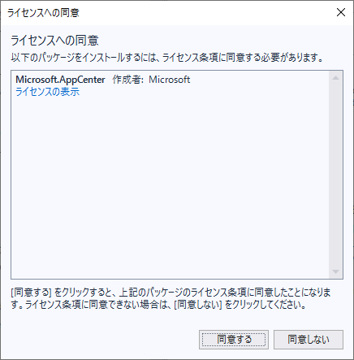

# App Centerの導入

## アカウントの作成


## GitHub Appsの導入と


# Projectの作成


登録

https://appcenter.ms/create-account


- 


## プロジェクトの作成

Visual StudioでXamarin.Formsのプロジェクトを作成します。

メニューバーの「ファイル」→「新規作成」→「プロジェクト」を選択します。

プロジェクトの候補から「Cross-Platform」を選択し、モバイルアプリ(Xamarin.Forms)を選択します。([@fig:img_045_100_image])

{#fig:img_045_100_image}

続いて、以下プルダウンから「Master-Detail」を選択します。([@fig:img_045_110_image])

{#fig:img_045_110_image}

本書では、以下プロジェクト名として「CalendarViewer」を使用します。

<div class="column">

### Xamarin.Formsのソリューション名の制約

Visual Studio For Macでは、`-`または`_`を含むソリューション名で作成したXamarin.Formsのプロジェクトを読み込むと、Androidプロジェクトの
`MainActivity.cs`で`The type or namespace name 'App' could not be found `というコンパイルエラーが発生する問題があります。<span class="footnote">[https://stackoverflow.com/a/52317040](https://stackoverflow.com/a/52317040)</span>この問題を回避するためには、
プロジェクト作成時の「新しいプロジェクト」画面で、`-`または`_`を含まない名前でプロジェクトを作成します。

</div>

## AppCenterの導入

## App Centerのパッケージの導入

App Centerでの以下の機能を使用するには、Microsoftが提供するSDKをソリューションに
導入する必要があります。

- クラッシュレポート
- アプリ内更新
- プッシュ通知

SDKは以下のNuGetパッケージの形式で提供されています。

- Microsoft.AppCenter
- Microsoft.AppCenter.Analytics
- Microsoft.AppCenter.Crashes
- Microsoft.AppCenter.Distribute

<div class="column">

### App CenterのSDKはオープンソースです

App Centerで提供される各種のツールはオープンソースで開発が進められています。
App CenterのSDKは以下のGitHubレポジトリーで公開されています。

- [https://github.com/Microsoft/AppCenter-SDK-DotNet](https://github.com/Microsoft/AppCenter-SDK-DotNet)

</div>

以下、Visual Studio 2017でのSDKの導入手順を説明します。

メニューバーの「プロジェクト」→「NuGetパッケージの管理」を選択します。({@fig:img_120_image})

{#fig:img_120_image}

テキストボックスに「appcenter」と入力して、Microsoft.AppCenterを選択します。({@fig:img_130_image})

{#fig:img_130_image}

ライセンスへの同意を確認し、「同意する」を選択します。

{#fig:img_140_image}

Microsoft.AppCenterのパッケージをVisual Studioがダウンロードし、端末にインストールされます。

以下のパッケージについて、同様にNuGetパッケージをインストールします。

- Microsoft.AppCenter.Analytics
- Microsoft.AppCenter.Crashes
- Microsoft.AppCenter.Distribute

続いて、ソリューションにNuGetパッケージを設定します。

メニューバーの、「ツール」→「NuGetパッケージマネージャー」→「ソリューションのNuGetパッケージの管理」を選択します。({@fig:img_150_image})

{#fig:img_150_image}

「インストール済み」の項目の「Microsoft.AppCenter」を選択します。
画面右側の「プロジェクト」の右側のチェックボックスにチェックを入れて、全てのプロジェクトを選択状態にし、「インストール」を選択します。({@fig:img_160_image})

{#fig:img_160_image}

ライセンスへの同意を確認し、「同意する」を選択します。({@fig:img_170_image})

{#fig:img_170_image}

メニューバーの「ファイル」から「(ソリューション名).slnの保存」を選択します。({@fig:img_180_image})

{#fig:img_180_image}

この状態でコマンドプロンプト等から`git status`コマンドで状態を確認すると、
以下のファイルが編集され、SDKのインストールが設定されています。

- CalendarViewer/CalendarViewer.Android/CalendarViewer.Android.csproj
- CalendarViewer/CalendarViewer.iOS/CalendarViewer.iOS.csproj
- CalendarViewer/CalendarViewer/CalendarViewer.csproj


```
> git status
On branch master
Changes not staged for commit:
  (use "git add <file>..." to update what will be committed)
  (use "git checkout -- <file>..." to discard changes in working directory)

        modified:   CalendarViewer/CalendarViewer.Android/CalendarViewer.Android.csproj
        modified:   CalendarViewer/CalendarViewer.iOS/CalendarViewer.iOS.csproj
        modified:   CalendarViewer/CalendarViewer/CalendarViewer.csproj
```

`git diff`コマンドで編集内容を確認すると、以下の様になっています。

```
diff --git a/CalendarViewer/CalendarViewer.Android/CalendarViewer.Android.csproj b/CalendarViewer/CalendarViewer.Android/CalendarViewer.Android.csproj
index bbd2bc8..a722ee3 100644
--- a/CalendarViewer/CalendarViewer.Android/CalendarViewer.Android.csproj
+++ b/CalendarViewer/CalendarViewer.Android/CalendarViewer.Android.csproj
@@ -45,7 +45,7 @@
     <AndroidManagedSymbols>true</AndroidManagedSymbols>
     <AndroidUseSharedRuntime>false</AndroidUseSharedRuntime>
   </PropertyGroup>
- <ItemGroup>
+  <ItemGroup>
     <Reference Include="Mono.Android" />
     <Reference Include="System" />
     <Reference Include="System.Core" />
@@ -53,6 +53,18 @@
     <Reference Include="System.Xml" />
   </ItemGroup>
   <ItemGroup>
+    <PackageReference Include="Microsoft.AppCenter">
+      <Version>1.13.2</Version>
+    </PackageReference>
+    <PackageReference Include="Microsoft.AppCenter.Analytics">
+      <Version>1.13.2</Version>
+    </PackageReference>
+    <PackageReference Include="Microsoft.AppCenter.Crashes">
+      <Version>1.13.2</Version>
+    </PackageReference>
+    <PackageReference Include="Microsoft.AppCenter.Distribute">
+      <Version>1.13.2</Version>
+    </PackageReference>
     <PackageReference Include="Xamarin.Forms" Version="3.4.0.1008975" />
     <PackageReference Include="Xamarin.Android.Support.Design" Version="27.0.2.1" />
     <PackageReference Include="Xamarin.Android.Support.v7.AppCompat" Version="27.0.2.1" />
@@ -68,7 +80,9 @@
   <ItemGroup>
     <None Include="Resources\AboutResources.txt" />
     <None Include="Assets\AboutAssets.txt" />
-    <None Include="Properties\AndroidManifest.xml" />
+    <None Include="Properties\AndroidManifest.xml">
+      <SubType>Designer</SubType>
+    </None>
   </ItemGroup>
   <ItemGroup>
     <AndroidResource Include="Resources\layout\Tabbar.axml" />
diff --git a/CalendarViewer/CalendarViewer.iOS/CalendarViewer.iOS.csproj b/CalendarViewer/CalendarViewer.iOS/CalendarViewer.iOS.csproj
index e379363..11973d4 100644
--- a/CalendarViewer/CalendarViewer.iOS/CalendarViewer.iOS.csproj
+++ b/CalendarViewer/CalendarViewer.iOS/CalendarViewer.iOS.csproj
@@ -151,6 +151,18 @@
     <Reference Include="Xamarin.iOS" />
   </ItemGroup>
   <ItemGroup>
+    <PackageReference Include="Microsoft.AppCenter">
+      <Version>1.13.2</Version>
+    </PackageReference>
+    <PackageReference Include="Microsoft.AppCenter.Analytics">
+      <Version>1.13.2</Version>
+    </PackageReference>
+    <PackageReference Include="Microsoft.AppCenter.Crashes">
+      <Version>1.13.2</Version>
+    </PackageReference>
+    <PackageReference Include="Microsoft.AppCenter.Distribute">
+      <Version>1.13.2</Version>
+    </PackageReference>
     <PackageReference Include="Xamarin.Forms" Version="3.4.0.1008975" />
   </ItemGroup>
   <Import Project="$(MSBuildExtensionsPath)\Xamarin\iOS\Xamarin.iOS.CSharp.targets" />
diff --git a/CalendarViewer/CalendarViewer/CalendarViewer.csproj b/CalendarViewer/CalendarViewer/CalendarViewer.csproj
index 89a24d3..040d2f5 100644
--- a/CalendarViewer/CalendarViewer/CalendarViewer.csproj
+++ b/CalendarViewer/CalendarViewer/CalendarViewer.csproj
@@ -16,6 +16,10 @@
   </PropertyGroup>
 
   <ItemGroup>
+    <PackageReference Include="Microsoft.AppCenter" Version="1.13.2" />
+    <PackageReference Include="Microsoft.AppCenter.Analytics" Version="1.13.2" />
+    <PackageReference Include="Microsoft.AppCenter.Crashes" Version="1.13.2" />
+    <PackageReference Include="Microsoft.AppCenter.Distribute" Version="1.13.2" />
     <PackageReference Include="Xamarin.Forms" Version="3.4.0.1008975" />  
   </ItemGroup>
 </Project>
\ No newline at end of file
```

これらのファイルをGitにコミットし、リモートレポジトリにpushします。

<div class="column">

## CIとビルドスクリプト

</div>

