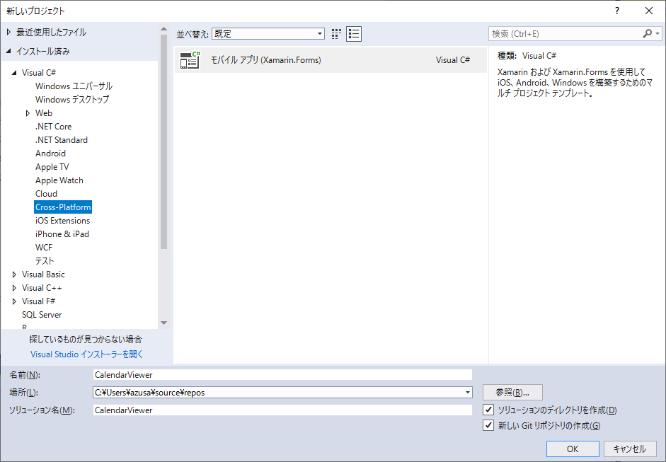
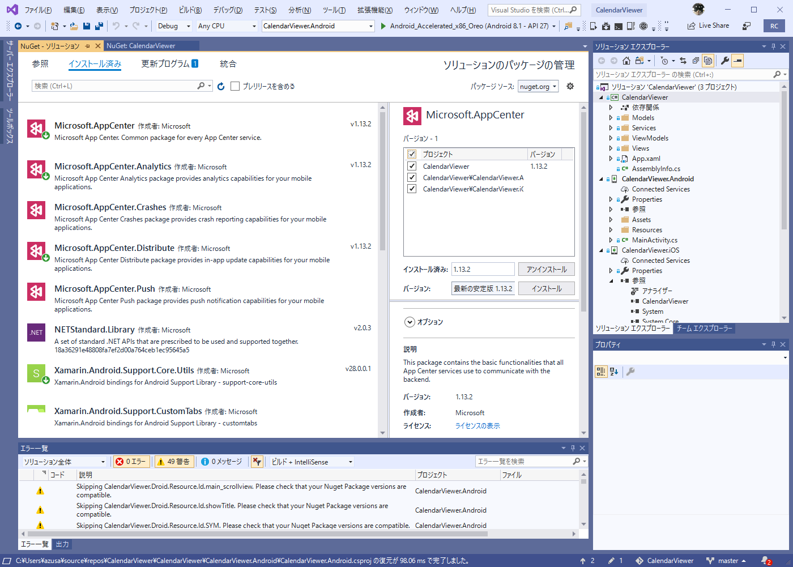

# 4.Xamarin.Formsプロジェクトの作成

App Centerでアプリケーションのビルドをするにあたって、Xamarin.Formsアプリケーションのプロジェクトの
作成手順を説明します。本書では以下、この手順で作成したプロジェクトの構成をもとにして解説します。

## Xamarin.Formsのプロジェクトの作成

メニューバーの「ファイル」→「新規作成」→「プロジェクト」を選択します。

プロジェクトの候補から「Cross-Platform」を選択し、モバイルアプリ(Xamarin.Forms)を選択します。([@fig:img_045_100_image])

{#fig:img_045_100_image}

プロジェクト名を入力します。本書では、以下プロジェクト名として「CalendarViewer」を使用します。

{#fig:img_045_105_image}

続いて、テンプレートから「Master-Detail」を選択します。([@fig:img_045_110_image])

{#fig:img_045_110_image}

プロジェクトが作成されたら、ソリューションをバージョン管理に追加します。メニューバーの「ファイル」→「ソース管理」を選択します。([@fig:img_045_115_image])

{#fig:img_045_115_image}

なお、Visual Studio2017では、このメニューはプロジェクト作成時の「新しいGitリポジトリの作成」のオプションの箇所にあります。([@fig:img_045_116_image])

{#fig:img_045_116_image}

<div class="block">

### Xamarin.Formsのソリューション名の制約

Visual Studio For Macでは、Xamarin.Formsのプロジェクトを読み込む時にソリューション名に`-`または`_`を含んでいると、
Androidプロジェクトの`MainActivity.cs`で`The type or namespace name 'App' could not be found `というコンパイルエラーが発生する問題があります。<span class="footnote">[https://stackoverflow.com/a/52317040](https://stackoverflow.com/a/52317040)</span>この問題を回避するためには、
プロジェクト作成時の「新しいプロジェクト」画面で、`-`または`_`を含まない名前でプロジェクトを作成します。

</div>

## App CenterのSDKの導入

App Centerでの以下の機能を使用するには、Microsoftが提供するSDKをプロジェクトに
導入する必要があります。

- クラッシュレポート
- アプリ内更新
- プッシュ通知

SDKは以下のNuGetパッケージの形式で提供されています。

- Microsoft.AppCenter
- Microsoft.AppCenter.Analytics
- Microsoft.AppCenter.Crashes
- Microsoft.AppCenter.Distribute

<div class="block">

### App CenterのSDKはオープンソースです

App Centerで提供される各種のツールはオープンソースで開発が進められています。

App CenterのSDKは以下のGitHubレポジトリーで公開されています。

- [https://github.com/Microsoft/AppCenter-SDK-DotNet](https://github.com/Microsoft/AppCenter-SDK-DotNet)
- [https://github.com/Microsoft/AppCenter-SDK-Apple](https://github.com/Microsoft/AppCenter-SDK-Apple)
- [https://github.com/Microsoft/AppCenter-SDK-Android](https://github.com/Microsoft/AppCenter-SDK-Android)
- [https://github.com/Microsoft/AppCenter-SDK-React-Native](https://github.com/Microsoft/AppCenter-SDK-React-Native)

</div>

以下、Visual Studio 2019でのSDKの導入手順を説明します。

メニューバーの「プロジェクト」→「NuGetパッケージの管理」を選択します。([@fig:img_120_image])

{#fig:img_120_image}

テキストボックスに「appcenter」と入力して、Microsoft.AppCenterを選択して「インストール」を選択します。([@fig:img_130_image])

{#fig:img_130_image}

ライセンスの内容を確認し、「同意する」を選択します。

{#fig:img_140_image}

ライセンスに同意すると、Microsoft.AppCenterのパッケージをVisual Studioがダウンロードし、端末にインストールします。

以下のパッケージについて、同様にNuGetパッケージをインストールします。

- Microsoft.AppCenter.Analytics
- Microsoft.AppCenter.Crashes
- Microsoft.AppCenter.Distribute

続いて、ソリューションにNuGetパッケージを設定します。

メニューバーの、「ツール」→「NuGetパッケージマネージャー」→「ソリューションのNuGetパッケージの管理」を選択します。([@fig:img_150_image])

{#fig:img_150_image}

「インストール済み」の項目の「Microsoft.AppCenter」を選択します。
画面右側の「プロジェクト」の右側のチェックボックスにチェックを入れて、全てのプロジェクトを選択状態にし、「インストール」を選択します。([@fig:img_160_image])

{#fig:img_160_image}

ライセンスへの同意を確認し、「同意する」を選択します。([@fig:img_170_image])

{#fig:img_170_image}

メニューバーの「ファイル」から「(ソリューション名).slnの保存」を選択します。([@fig:img_180_image])

{#fig:img_180_image}

この状態でコマンドプロンプト等から`git status`コマンドで状態を確認すると、
[@lst:code_045_010]のように以下のファイルが編集され、SDKのインストールが設定されています。

- CalendarViewer/CalendarViewer.Android/CalendarViewer.Android.csproj
- CalendarViewer/CalendarViewer.iOS/CalendarViewer.iOS.csproj
- CalendarViewer/CalendarViewer/CalendarViewer.csproj


```{#lst:code_045_010 caption="git statusの状態"}
> git status
On branch master
Changes not staged for commit:
  (use "git add <file>..." to update what will be committed)
  (use "git checkout -- <file>..." to discard changes in working directory)

        modified:   CalendarViewer/CalendarViewer.Android/CalendarViewer.Android.csproj
        modified:   CalendarViewer/CalendarViewer.iOS/CalendarViewer.iOS.csproj
        modified:   CalendarViewer/CalendarViewer/CalendarViewer.csproj
```

`git diff`コマンドで編集内容を確認すると、[@lst:code_045_020]の様になっています。

```{#lst:code_045_020 caption="git diffの出力"}
azusa@SOYOKAZE C:\Users\azusa\source\repos\CalendarViewer [master +0 ~3 -0]
> git diff
diff --git a/CalendarViewer/CalendarViewer.Android/CalendarViewer.Android.csproj b/CalendarViewer/CalendarViewer.Android/CalendarViewer.Android.csproj
index 66dbab1..4ecc35e 100644
--- a/CalendarViewer/CalendarViewer.Android/CalendarViewer.Android.csproj
+++ b/CalendarViewer/CalendarViewer.Android/CalendarViewer.Android.csproj
@@ -52,6 +52,18 @@
     <Reference Include="System.Xml" />
   </ItemGroup>
   <ItemGroup>
+    <PackageReference Include="Microsoft.AppCenter">
+      <Version>1.13.2</Version>
+    </PackageReference>
+    <PackageReference Include="Microsoft.AppCenter.Analytics">
+      <Version>1.13.2</Version>
+    </PackageReference>
+    <PackageReference Include="Microsoft.AppCenter.Crashes">
+      <Version>1.13.2</Version>
+    </PackageReference>
+    <PackageReference Include="Microsoft.AppCenter.Distribute">
+      <Version>1.13.2</Version>
+    </PackageReference>
     <PackageReference Include="Xamarin.Forms" Version="3.6.0.135200-pre1" />
     <PackageReference Include="Xamarin.Android.Support.Design" Version="28.0.0.1" />
     <PackageReference Include="Xamarin.Android.Support.v7.AppCompat" Version="28.0.0.1" />
diff --git a/CalendarViewer/CalendarViewer.iOS/CalendarViewer.iOS.csproj b/CalendarViewer/CalendarViewer.iOS/CalendarViewer.iOS.csproj
index c9d4f36..250beba 100644
--- a/CalendarViewer/CalendarViewer.iOS/CalendarViewer.iOS.csproj
+++ b/CalendarViewer/CalendarViewer.iOS/CalendarViewer.iOS.csproj
@@ -133,6 +133,18 @@
     <Reference Include="System.Numerics.Vectors" />
   </ItemGroup>
   <ItemGroup>
+    <PackageReference Include="Microsoft.AppCenter">
+      <Version>1.13.2</Version>
+    </PackageReference>
+    <PackageReference Include="Microsoft.AppCenter.Analytics">
+      <Version>1.13.2</Version>
+    </PackageReference>
+    <PackageReference Include="Microsoft.AppCenter.Crashes">
+      <Version>1.13.2</Version>
+    </PackageReference>
+    <PackageReference Include="Microsoft.AppCenter.Distribute">
+      <Version>1.13.2</Version>
+    </PackageReference>
     <PackageReference Include="Xamarin.Forms" Version="3.6.0.135200-pre1" />
     <PackageReference Include="Xamarin.Essentials" Version="1.0.1" />
   </ItemGroup>
diff --git a/CalendarViewer/CalendarViewer/CalendarViewer.csproj b/CalendarViewer/CalendarViewer/CalendarViewer.csproj
index 68bf49a..e873f65 100644
--- a/CalendarViewer/CalendarViewer/CalendarViewer.csproj
+++ b/CalendarViewer/CalendarViewer/CalendarViewer.csproj
@@ -11,6 +11,11 @@
   </PropertyGroup>

   <ItemGroup>
+    <PackageReference Include="Microsoft.AppCenter" Version="1.13.2" />
+    <PackageReference Include="Microsoft.AppCenter.Analytics" Version="1.13.2" />
+    <PackageReference Include="Microsoft.AppCenter.Crashes" Version="1.13.2" />
+    <PackageReference Include="Microsoft.AppCenter.Distribute" Version="1.13.2" />
+    <PackageReference Include="Microsoft.AppCenter.Push" Version="1.13.2" />
     <PackageReference Include="Xamarin.Forms" Version="3.6.0.135200-pre1" />
     <PackageReference Include="Xamarin.Essentials" Version="1.0.1" />
   </ItemGroup>

azusa@SOYOKAZE C:\Users\azusa\source\repos\CalendarViewer [master +0 ~3 -0]
>
```

これらのファイルをGitにコミットし、リモートレポジトリーにpushします。

以上の変更をコミットして、リモートレポジトリーにpushします。

<div class="block">

## CIとビルドスクリプト

例えばJavaアプリケーションの場合、`pom.xml`や`build.gradle`などのビルド処理を行うための
スクリプトのファイルがプロジェクトのルートに存在します。CIでのビルドを行う場合は、この
ビルドスクリプトの記述にしたがってビルドを行います。

対して、Xamarin.Formsのように.NET Framrworkのアプリケーションのビルドでは、
`.sln`や`.csproj`など、IDE(統合開発環境)であるVisual Studioの設定をもとにして
CIでのビルドを行います。このことはApp CenterやAzure DevOpsなどのAzure上のサービスで
CIを行う上での大きな特徴になっています。

</div>

ここまでの例にしたがってプロジェクトを作成すると、以下のディレクトリーおよびファイル
構成ができあがります。ファイルについては主要なものを記述しました。([@lst:code_045_090])

```{#lst:code_045_090 caption="ディレクトリーおよびファイル構成"}
└─CalendarViewer
    ├─CalendarViewer
    │  │  App.xaml
    │  │  App.xaml.cs
    │  │  AssemblyInfo.cs
    │  │  CalendarViewer.csproj
    │  ├─Models
    │  ├─Services
    │  ├─ViewModels
    │  └─Views
    │          
    ├─CalendarViewer.Android
    │  │  CalendarViewer.Android.csproj
    │  │  CalendarViewer.Android.csproj.user
    │  │  MainActivity.cs
    │  ├─Properties
    │  │      AndroidManifest.xml
    │  │      AssemblyInfo.cs
    │  │      
    │  └─Resources
    │              
    └─CalendarViewer.iOS
        │  AppDelegate.cs
        │  CalendarViewer.iOS.csproj
        │  Entitlements.plist
        │  Info.plist
        │  Main.cs
        │  
        ├─Assets.xcassets
        ├─Properties
        │      AssemblyInfo.cs
        │      
        └─Resources
```

次の章では、このプロジェクト構成を元にして、App Centerでのアカウント作成及びビルドのための設定について説明します。