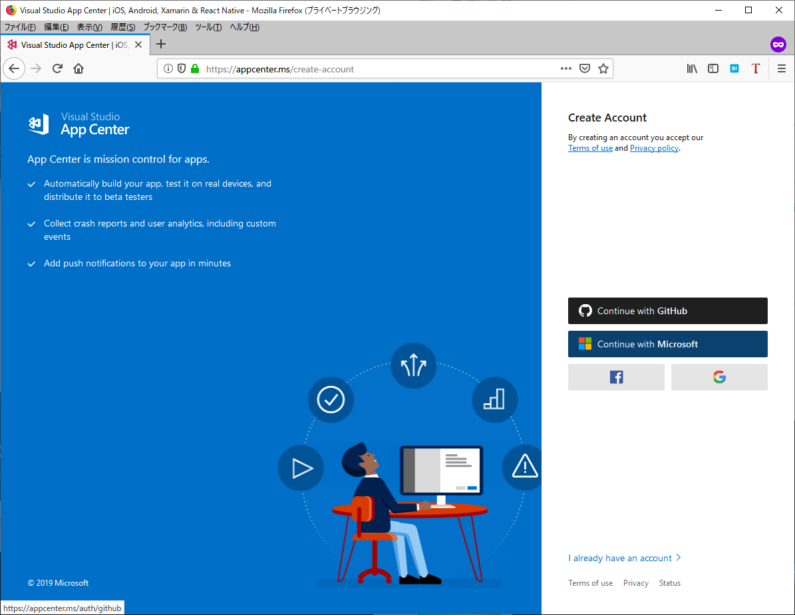
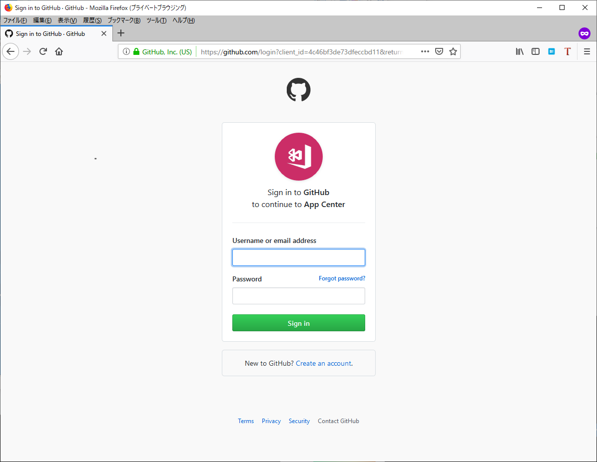
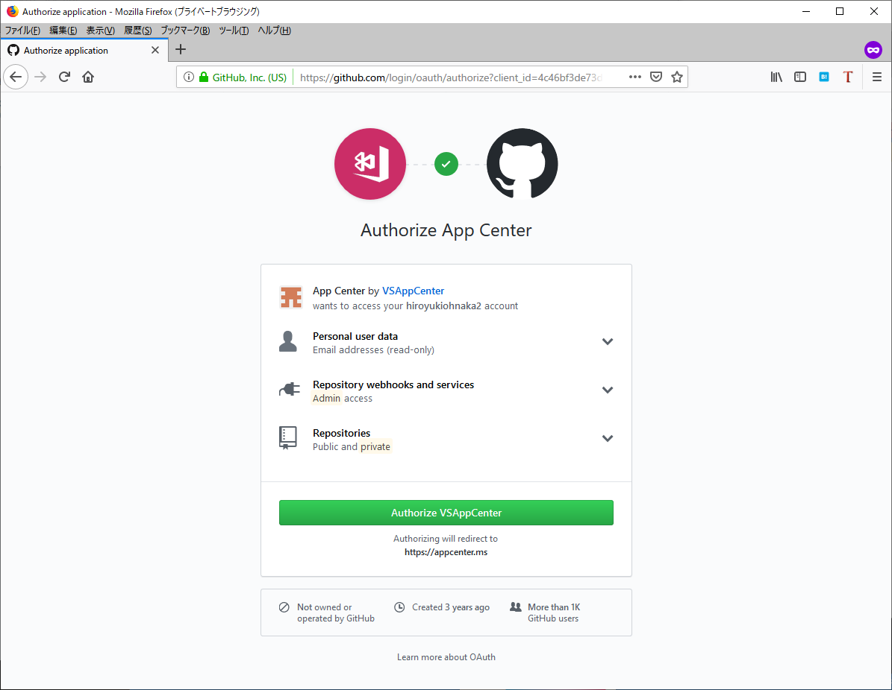
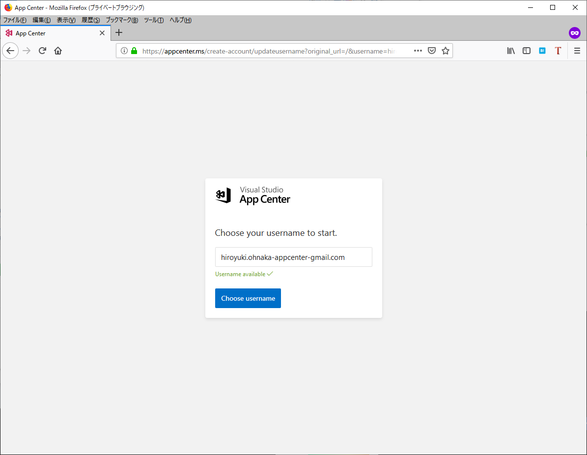
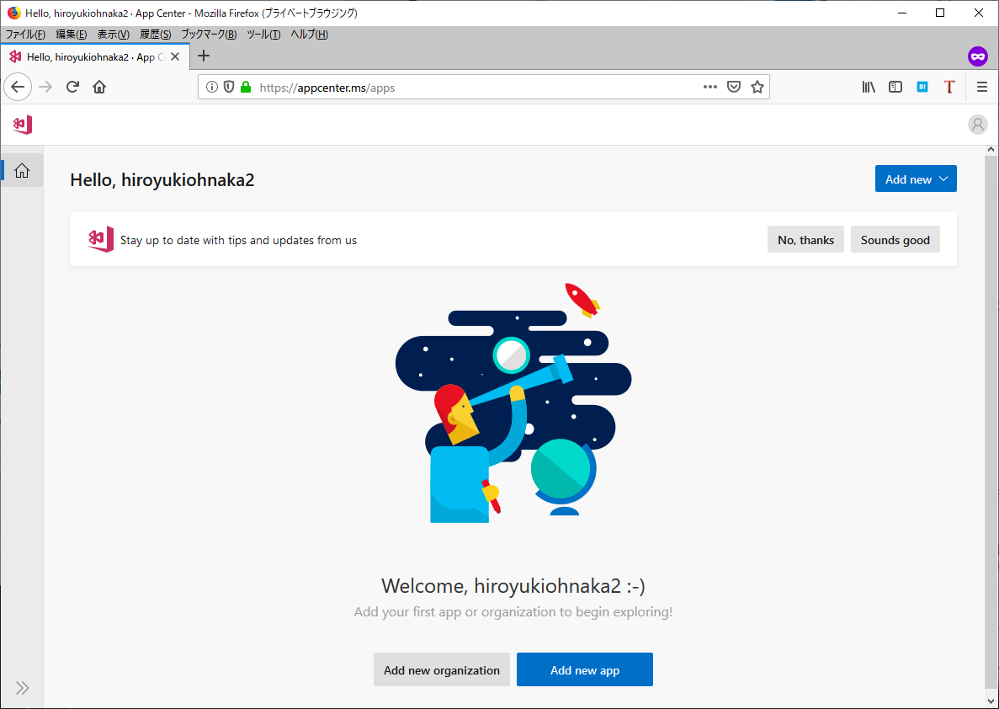
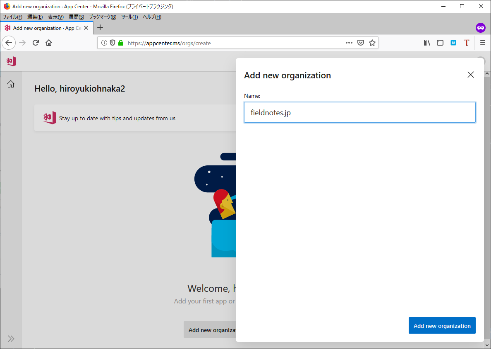
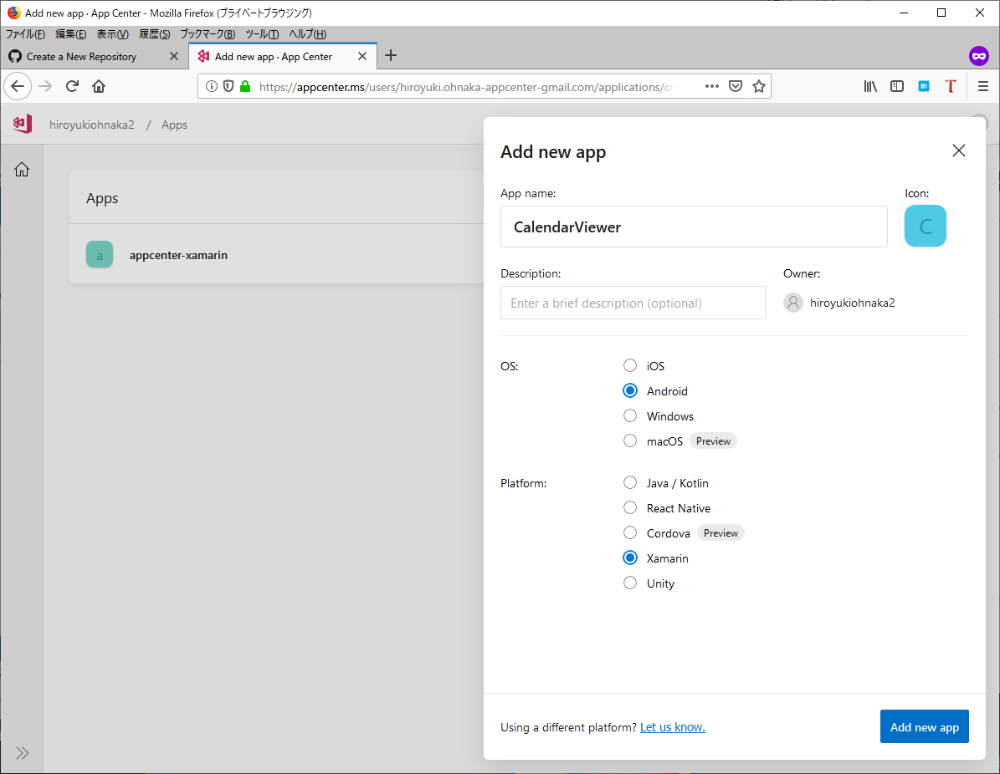
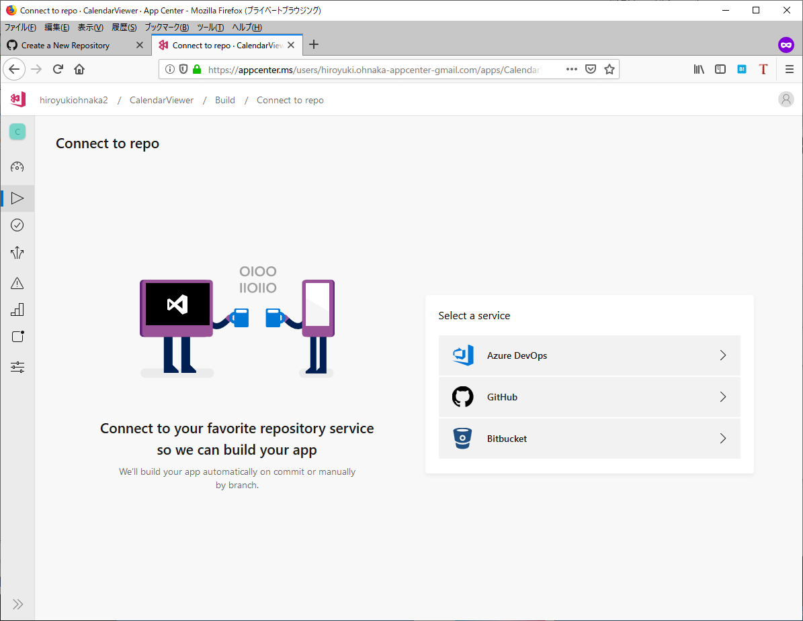
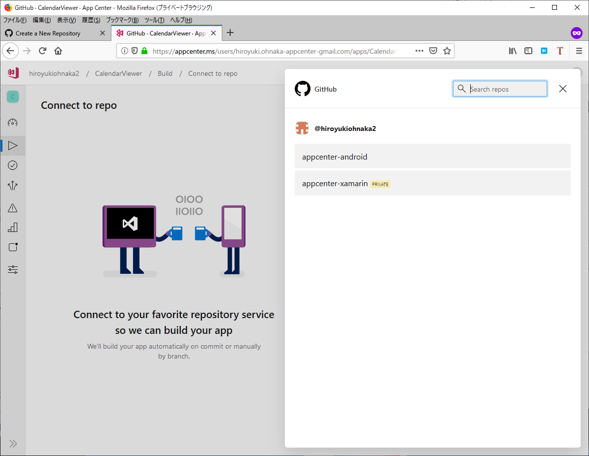

# App Centerの導入

この章では、App Centerのアカウントを作成し、初期設定を行う手順について説明します。

## アカウントの作成

App Centerのアカウント作成は、[https://appcenter.ms/create-account](https://appcenter.ms/create-account)
より行います。App Centerのアカウントの認証は、以下のサービスのアカウントを用いて行います。

- Microsoftアカウント
- GitHub
- Facebook
- Google

ここでは、GitHubアカウントを使用したアカウント作成について説明します。

[@fig:img_046_010_image]の画面で「Continue With GitHub」のリンクを選択します。

{#fig:img_046_010_image}

続いて、[@fig:img_046_020_image]の画面でGitHubのアカウント情報を入力し、サインインします。

{#fig:img_046_020_image}

[@fig:img_046_030_image]の画面でGitHubに対して要求されている権限の内容を確認し、「Authorize VSAppCenter」のボタンを選択します。

{#fig:img_046_030_image}

App Centerの画面に戻り、[@fig:img_046_040_image]の画面でApp Center上でのユーザーの表示名を入力して「Choose username」のボタンを選択します。

{#fig:img_046_040_image}

App Centerのアカウントが作成され、[@fig:img_046_050_image]の初期画面が表示されます。

{#fig:img_046_050_image}

アプリケーションを組織で管理する場合は、Oragnizationを作成します。[@fig:img_046_050_image]の画面の「Add new organization」のボタンを選択します。

[@fig:img_046_060_image]の画面でOragnizationの名称を入力し、「Add new organization」のボタンを選択します。

{#fig:img_046_060_image}

続けて、App Center上でのビルド・配布の単位となる「App」を作成します。以降、「アプリケーション」と呼称します。

[@fig:img_046_050_image]の画面で「Add app」のボタンを選択します。

[@fig:img_046_070_image]の画面でアプリケーションの情報を入力し、「Add new app」を選択します。App Centerでは、クロスプラットフォームのアプリケーションについてはプラットフォームごとにアプリケーションを作成します。ここでは、先にXamarinのAndroidのアプリケーションを作成します。

{#fig:img_046_070_image}

アプリケーションを作成した後は、[@fig:img_046_080_image]の画面でGitレポジトリーを選択します。App Centerでは、以下のバージョン管理サービスを使用することができます。

- Azure DevOps
- GitHub
- Bitbucket

{#fig:img_046_080_image}

いずれのサービスもクラウド上と、オンプレミスでの提供形態がありますが、App Centerがサポートするのはクラウド上のGitレポジトリーです。

続いて、[@fig:img_046_090_image]の画面で連携しているアカウントでのレポジトリーを選択します。

{#fig:img_046_090_image}

レポジトリーを選択すると、App Centerがレポジトリー上の構成を読み取って、ビルドに使用するVisual Studioのソリューションの設定など、基本的なビルドの設定を行います。

続いて、iOSのアプリケーションの設定を行います。画面上部のぱんくずメニューから、Oragnizationを選択した後、「Add new app」を選択し、iOSアプリケーションの作成を行います。

### アプリケーションのURLは変更不可

App Centerは、アプリケーションの作成後、アプリケーションの名称は画面から変更することができますが、
アプリケーションに対するApp Center上でのURLは変更することができません。

アプリケーションのURLを変更したい場合は、App Center上でのアプリケーションを一度削除した後、再作成することになります。

App Centerでは、アプリケーションを作成した後、初回のビルドを行うためには、ブランチごとにビルドに必要な設定を行う必要があります。

次の章以降では、AndroidとiOSのそれぞれで、ビルドに必要な設定を紹介します。