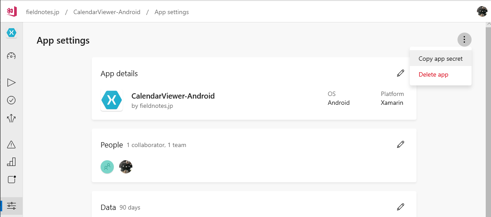

# 5.App Centerの導入

この章では、App Centerのアカウントを作成し、初期設定を行う手順について説明します。

## アカウントの作成

App Centerのアカウント作成は、[https://appcenter.ms/create-account](https://appcenter.ms/create-account)
より行います。App Centerのアカウントの認証は、以下のサービスのアカウントを用いて行います。

- Microsoftアカウント
- GitHub
- Facebook
- Google

ここでは、GitHubアカウントを使用したアカウント作成について説明します。

[@fig:img_046_010_image]の画面で「Continue With GitHub」のリンクを選択します。

{#fig:img_046_010_image}

続いて、[@fig:img_046_020_image]の画面でGitHubのアカウント情報を入力し、サインインします。

{#fig:img_046_020_image}

[@fig:img_046_030_image]の画面でGitHubに対して要求されている権限の内容を確認し、「Authorize VSAppCenter」のボタンを選択します。

{#fig:img_046_030_image}

App Centerの画面に戻り、[@fig:img_046_040_image]の画面でApp Center上でのユーザーの表示名を入力して「Choose username」のボタンを選択します。

{#fig:img_046_040_image}

App Centerのアカウントが作成され、[@fig:img_046_050_image]の初期画面が表示されます。

{#fig:img_046_050_image}

アプリケーションを組織で管理する場合は、Oragnizationを作成します。[@fig:img_046_050_image]の画面の「Add new organization」のボタンを選択します。

[@fig:img_046_060_image]の画面でOragnizationの名称を入力し、「Add new organization」のボタンを選択します。

{#fig:img_046_060_image}

続けて、App Center上でのビルド・配布の単位となる「App」を作成します。以降、「アプリケーション」と呼称します。

[@fig:img_046_050_image]の画面で「Add app」のボタンを選択します。

[@fig:img_046_070_image]の画面でアプリケーションの情報を入力し、「Add new app」を選択します。App Centerでは、クロスプラットフォームのアプリケーションについてはプラットフォームごとにアプリケーションを作成します。ここでは、先にXamarinのAndroidのアプリケーションを作成します。

{#fig:img_046_070_image}

アプリケーションを作成した後は、[@fig:img_046_080_image]の画面でGitレポジトリーを選択します。App Centerでは、以下のバージョン管理サービスを使用することができます。

- Azure DevOps
- GitHub
- Bitbucket

<div class="block">

### App CenterのアプリケーションのURLは変更不可

App Centerは、アプリケーションの作成後、アプリケーションの名称は画面から変更することができますが、
アプリケーションに対するApp Center上でのURLは変更することができません。

アプリケーションのURLを変更したい場合は、App Center上でのアプリケーションを一度削除した後、再作成することになります。

</div>


{#fig:img_046_080_image}

いずれのサービスもクラウド上と、オンプレミスでの提供形態がありますが、App Centerがサポートするのはクラウド上のGitレポジトリーです。

続いて、[@fig:img_046_090_image]の画面で連携しているアカウントでのレポジトリーを選択します。

{#fig:img_046_090_image}

レポジトリーを選択すると、App Centerがレポジトリー上の構成を読み取って、ビルドに使用するVisual Studioのソリューションの設定など、基本的なビルドの設定を行います。

続いて、iOSのアプリケーションの設定を行います。画面上部のぱんくずメニューから、Oragnizationを選択した後、「Add new app」を選択し、iOSアプリケーションの作成を行います。

## App CenterのSDKの組み込み

続いて、アプリケーションにApp CenterのSDKの開始コードを組み込みます。

### Xamarin.Formsの場合

AppCenterの各アプリケーションの「OverView」の画面を参考にしながら、
SDKの開始コードを組み込みます。

親プロジェクトの`App.xaml.cs`に[@lst:code_045_030]の`using`文を追加します。

```{#lst:code_045_030 caption="using文"}
using Microsoft.AppCenter;
using Microsoft.AppCenter.Analytics;
using Microsoft.AppCenter.Crashes;
using Microsoft.AppCenter.Distribute;
```

続いて`OnStart()`メソッドに、[@lst:code_045_040]の記述を追加します。

```{#lst:code_045_040 caption="OnStartメソッドの記述"}
protected override void OnStart()
{
  AppCenter.Start("android={Your Android App secret here};ios={Your iOS App secret here}", typeof(Analytics), typeof(Crashes), typeof(Distribute));
}
```

`{Your Android App secret here}`ならびに`{Your iOS App secret here}`となっている箇所は、App Centerのアプリケーションのシークレットに置換します。<span class="footenote">この後の[@lst:code_045_060]および[@lst:code_045_080]においても同様です。</span>

App Centerでは、AndroidとiOSなど、プラットフォームごとに別の
アプリケーションとしてビルドを行います。

このため、プラットフォームごとに別のシークレットを設定する必要があります。

それぞれのアプリケーションごとのシークレットは、App Centerのアプリケーションの
App Settings画面([@fig:img_190_image])の「Copy app secret」のメニューからコピーします。

{#fig:img_190_image}

### Androidアプリケーションの場合

Android単独のアプリケーションの場合は、プロジェクトの`MainActivity.cs`<span class="footnote">Xamarin.Forms.Platform.Android.FormsAppCompatActivityクラスを継承したクラス</span>に以下のコードを追加します。

[@lst:code_045_050]のusing文を追記します。

```{#lst:code_045_050 caption="using文"}
using Microsoft.AppCenter;
using Microsoft.AppCenter.Analytics;
using Microsoft.AppCenter.Crashes;
using Microsoft.AppCenter.Distribute;
```

[@lst:code_045_060]における`OnCreate`メソッドの`LoadApplication`メソッドの呼び出し箇所の前に`AppCenter`クラスの`Start`メソッドの呼び出しを追加します。

```{#lst:code_045_060 caption="OnCreateメソッドの記述"}
protected override void OnCreate(Bundle savedInstanceState)
{
  TabLayoutResource = Resource.Layout.Tabbar;
  ToolbarResource = Resource.Layout.Toolbar;
  base.OnCreate(savedInstanceState);

  Xamarin.Essentials.Platform.Init(this, savedInstanceState);
  global::Xamarin.Forms.Forms.Init(this, savedInstanceState);
  AppCenter.Start("{Your Android App Secret}", typeof(Crashes),typeof(Analytics), typeof(Distribute));
  LoadApplication(new App());
}

```

### iOSアプリケーションの場合

iOS単独のアプリケーションの場合は、プロジェクトの`AppDelegate.cs`<span class="footnote">Xamarin.Forms.Platform.iOS.FormsApplicationDelegateクラスを拡張したクラス</span>に以下のコードを追加します。

[@lst:code_045_070]のusing文を追記します。

```{#lst:code_045_070 caption="using文"}
using Microsoft.AppCenter;
using Microsoft.AppCenter.Analytics;
using Microsoft.AppCenter.Crashes;
using Microsoft.AppCenter.Distribute;
```

[@lst:code_045_080]における`FinishedLaunching`メソッド内の`LoadApplication`メソッドの呼び出し箇所の前に`AppCenter`クラスの`Start`メソッドの呼び出しを

```{#lst:code_045_080 caption="FinishedLaunchingメソッド"}
public override bool FinishedLaunching(UIApplication app, NSDictionary options)
{
  global::Xamarin.Forms.Forms.Init();
  AppCenter.Start("{Yout iOS App secret}", typeof(Analytics), typeof(Crashes), typeof(Distribute));
  LoadApplication(new App());
  return base.FinishedLaunching(app, options);
}
```

App Centerでは、アプリケーションを作成した後、初回のビルドを行うためには、ブランチごとにビルドに必要な設定を行う必要があります。

次の章以降では、AndroidとiOSのそれぞれで、ビルドに必要な設定を紹介します。