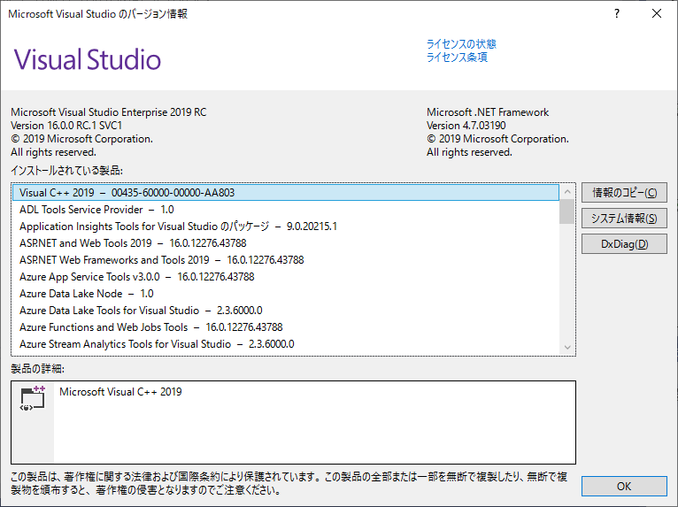

# App CenterによるAndroidアプリケーションの自動ビルド

この設定では、App CenterでAndroidアプリケーションの自動ビルドを行うために、ブランチごとに必要な設定を説明します。

App Centerのビルドの設定のための画面は、「Build」のメニューを選択して表示される「Branches」画面の、右側の歯車を選択して表示します。

## Configration

「Configuration」では、ビルドを行う際の構成を選択します。

Visual Studioの「構成マネージャー」の「構成」の設定に相当します。

App CenterでAndroidアプリケーションをビルドする際、ビルドしたAPK<span class="footnote">Android application package </span>ファイルを
実機で起動する場合は、通常「Configuration」を「Relelase」に設定します。

App Centerで、実機テスト(Test on real device)および、APKの端末への配布を行うには、以下の設定がビルドごとに必要です。

- Andoirdプロジェクトの設定で、「Androidオプション」→「共有ランタイム」の使用にチェックが入っていないこと
- KeyStoreでビルドが署名されていること(後述)

Xamarin.Anroidでは、デバッグ時に、共有ランタイム<span class="footnote">Shared RuntimeないしMono Shared Runtimeと呼ばれる</span>という、
ユーザーアプリケーションとは別のパッケージをインストールします。

これは、一つのXamarin.Androidパッケージにつき、一度だけ行われます。 共有ランタイムとは、デバッグビルドを行う際に、アセンブリビルドの工程を省略し、ビルドおよび起動の時間の短縮をするために行われるものです。<span class="footnote">[https://www.buildinsider.net/mobile/insidexamarin/09](https://www.buildinsider.net/mobile/insidexamarin/09)</span>

App CenterでビルドしたAPKファイルを端末にインストールする際は、この共有ランタイムのインストールが行われないため、この設定が有効になっているとアプリケーションが起動しません。

「共有ランタイム」の設定は、Visual Studio2017で作成したXamarin.Andoroidのデフォルトでは、
Debugビルドでは有効、Releaseビルドでは有効になっています。

この設定を確認・変更するには、Xamarin.Androidプロジェクトのプロパティ上の「Androidオプション」→「パッケージング プロパティ」上の、
「共有ランタイム」のチェックを確認します。

Visual Studio For Macの場合はXamarin.Androidプロジェクトのプロパティ上の「ビルド」→「Androidのビルド」→「General」内の、「共有Monoランタイムを使用」です。

App CenterでXamarin.Androidプロジェクトのビルドを行う場合、
この設定は `.csproj`ファイル内の記述を通じて、ローカルでのビルド・デバッグを行う際と、App Center上でビルドを行う際に共有されます。

## SDKバージョンの指定

「SDK Version」では、ビルドに使用するSDKのバージョンを指定します。

Visual Studio上でビルドする時に使用していた
Xamarin.Androidのバージョンを確認するには、Visual Studioのメニューの「ヘルプ」→「バージョン情報」から、
「インストールされている製品」の表示でXamarin.Android SDKのバージョンの表示を参照します。<span class="footnote"> [https://stackoverflow.com/a/51417938](https://stackoverflow.com/a/51417938) </span>([@fig:img_045_100_image])

{#fig:img_050_200_image}

## Build Script

App Centerでは、ソリューションファイル(.sln)の設定に従ってビルドを行いますが、
以下の三カ所のポイントにおいて、スクリプトによる処理を差し込むことができます。

- Gitレポジトリーからのクローンの後(Post-clone)
- ビルドの前(Pre-build)
- ビルドの後(Post-build)

スクリプトに処理を追加するには、以下のファイル名のスクリプトをリポジトリーにコミットします。

### Post-clone

- `appcenter-post-clone.sh`  (iOSまたはAndroid)
- `appcenter-post-clone.ps1`  (UWP)

### Pre-build

- `appcenter-pre-build.sh`  (iOSまたはAndroid)
- `appcenter-pre-build.ps1` (UWP) 

### Post-build

- `appcenter-post-build.sh`  (iOSまたはAndroid)
- `appcenter-post-build.ps1`  (UWP)


## Sign Build

「Sign Build」の項目では、アプリケーションに対するデジタル署名の設定を行います。

App CenterでのAndoroidアプリケーションの実機テスト(Test on real device)および、APKの端末への配布を行うには、
APKファイルに対し、デジタル署名が行われている必要があります。<span class="footnote">https://developer.android.com/guide/publishing/app-signing?hl=ja</span>

App Centerの「Sign Build」の項目ではデジタル署名に行うキーストアのファイルをアップロードし、以下の設定を行います。

- キーストアのパスワード(Keystore password)
- キーの別名(Key alias)
- キーのパスワード(Key password)

なお、キーストアのパスワード等の設定が誤っている場合、エラー文言を介さず設定を保存することが出来ますが、
ビルド処理時の最後のステップの、アプリケーションへのデジタル署名を行う段階でビルドエラーとなります。

この挙動は、iOSアプリケーションの設定の挙動とは異なりますので、注意が必要です。

## Visual Studioで鍵を作成した場合の鍵の場所

デジタル署名用のキーストアは、通常のAndroidアプリケーションと同様の方法で作成します。

- Androidのキー作成

- Android Studioの「Generate Singed Bundle or APK」コマンド
- Java SE Development Kit(JDK)のkeytoolコマンド
- Visual Studioのアーカイブマネージャー

Visual Studioのアーカイブマネージャーで作成したキーストアは、
Visual StudioをインストールしているPCの以下のフォルダーに保存されています。

```
%USERPROFILE%\AppData\Local\Xamarin\Mono for Android\Keystore
```

## ブランチが増えた場合の設定

App Centerでは、環境変数や、デジタル署名のためのキーストアなど、
ビルドのために必要な設定はブランチが作成される都度に設定するようになっています。

このため、Gitリポジトリー上にブランチが作成された場合は、
上記の設定を

## API Keyなどの管理の方法～コード書き換え


- https://qiita.com/amay077/items/aac34280feefd7a1db8c
- http://shimbaroid.hatenablog.jp/entry/2016/08/15/010350


## AndroidManifestPlaceholdersによるビルド時の環境変数の書き換え

- http://www.raghurana.com/building-and-deploying-apps-using-vsts-and-hockeyapp-part-2nbsp-android
- https://github.com/xamarin/xamarin-android/pull/342


## AndroidManifestPlaceholdersによるビルド時の環境変数の書き換え

AndroidやiOSなどのプラットフォームでのアプリケーション開発では、APKファイルやIPAファイルを逆アセンブルすると
アプリケーション内の情報は解読できてしまうため、秘匿したい情報をコードから隠蔽することに積極的な意味はありません。

App Centerのドキュメント<span class="footnote">[https://docs.microsoft.com/en-us/appcenter/sdk/getting-started/xamarin](https://docs.microsoft.com/en-us/appcenter/sdk/getting-started/xamarin)</span>でも、App CenterのSDKを起動するためのSecret Keyは、
Androidアプリケーションにおける`MainActivity.cs`の`OnCreate`メソッドや
iOSアプリケーションにおける`AppDelegate.cs`の`FinishedLaunching`メソッドなど、
ソースコードに埋め込むようになっています。

しかし、ソースコードを公開している場合や、外部の業者に開発を委託する場合など、
ソースコード中にキーを埋め込みたくない場合があります。

Androidには、`AndroidManifest.xml` に記述したメタデータの値を<span class="footnote">https://developer.android.com/guide/topics/manifest/meta-data-element</span>、
アプリケーション内で `android.content.pm.PackageManager#getApplicationIcon`メソッド<span class="footnote">[https://developer.android.com/reference/android/content/pm/PackageManager.html#getApplicationInfo(java.lang.String,%20int)](https://developer.android.com/reference/android/content/pm/PackageManager.html#getApplicationInfo(java.lang.String,%20int))</span>を通して取得する仕組みがあります。

また、 `AndroidManifest.xml`内に例えば`${AppCenterSecret}`のように、`$`というプレースホルダーではじまるパラメータを記述することで、ビルドプロセスのシステムプロパティ等に設定した値を、`AndroidManifest.xml`に注入することができます。

Xamarin.FormsのAndroidプロジェクトでは、Androidプロジェクトの`.csproj`にplaceholderに注入する値を記述し、ビルド時の環境変数からこの値を設定することで、ビルド時に`AndroidManifest.xml`に値を設定し、アプリケーションから取得することができます。<span class="footnote">[https://github.com/xamarin/xamarin-android/pull/342](https://github.com/xamarin/xamarin-android/pull/342)</span>

まず、Androidプロジェクトの`.csproj`ファイルをテキストエディター等で開き、条件(`ConditionGroup`属性が)設定されていない`<PropertyGroup>`タグ配下に、以下の記述を追加します。

```
<AndroidManifestPlaceholders Condition=" '$(AndroidManifestPlaceholders)' == '' ">
    AppCenterSecret=default
</AndroidManifestPlaceholders>
```

ここで、`$(AndroidManifestPlaceHolders)`は、`msbuild`のビルドプロセスの環境変数`AndroidManifestPlaceholders`を参照しています。<span class="footnote">[https://docs.microsoft.com/en-us/visualstudio/msbuild/how-to-use-environment-variables-in-a-build?view=vs-2017](https://docs.microsoft.com/en-us/visualstudio/msbuild/how-to-use-environment-variables-in-a-build?view=vs-2017)</span>

`AppCenterSecret=default`の箇所は環境変数`AndroidManifestPlaceholders`が設定されていない場合のデフォルト値で、Visual Studio上でビルドが実行されている場合を想定しています。

続いて、AndroidProjectの`Properties/AndroidManifest.xml`の`<application>`タグを以下の通り修正します。

```
<application android:label="CalendarViewer.Android">
  <meta-data android:name="AppCenterSecret" android:value="${AppCenterSecret}"/>
</application>
```

最後に、Androidプロジェクトの`MainActity.cs`内のAppCenterのSDKの起動処理を以下の通りに修正します。

```
using Android.Content.PM;
(略)
var secret = PackageManager.GetApplicationInfo("jp.fieldnotes.tf06.CalendarViewer", PackageInfoFlags.MetaData).MetaData.GetString("AppCenterSecret");
AppCenter.Start(secret, typeof(Analytics), typeof(Crashes), typeof(Distribute));
```

ここで、`jp.fieldnotes.tf06.CalendarViewer`の箇所は、
`Properties/AndroidManifest.xml`で指定しているアプリケーションのパッケージ名であり、`<manifest>` 要素の `package` 属性で指定しているものです。

最後に、App Centerの「Build Configuration」の「Environment Variable」の項目に環境変数「AndroidManifestPlaceholders」を追加してビルドします。

- http://www.raghurana.com/building-and-deploying-apps-using-vsts-and-hockeyapp-part-2nbsp-android

## ブランチが増えた時の挙動

Gitのリモートリポジトリーに新しいブランチをpushすると、
「Build」に新しいブランチが作成されます。

このブランチの右側の「Settings」を選択し、
ビルドに必要な設定を行った上で「Save and Build」を、初回のビルドが実行されます。
