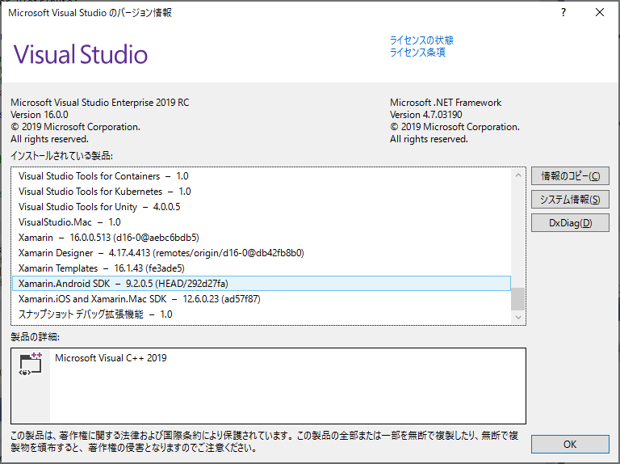

# 6.App CenterによるAndroidアプリケーションの自動ビルド

この設定では、App CenterでAndroidアプリケーションの自動ビルドを行うために、ブランチごとに必要な設定を説明します。

App Centerのビルドの設定のための画面は、「Build」のメニューを選択して表示される「Branches」画面の、右側の歯車を選択して表示します。

## Configuration

「Configuration」では、ビルドを行う際の構成を選択します。

これはVisual Studioの「構成マネージャー」の「構成」の設定に相当するもので、
Visual Studio上で開発を行う際の設定がバージョン管理を通して共有されます。

App CenterでAndroidアプリケーションをビルドする際、ビルドしたAPK<span class="footnote">Android application package </span>ファイルを
実機で起動する場合は、通常「Configuration」を「Release」ないしそれ相当の構成に設定します。

App Centerで、実機テスト(Test on real device)および、APKの端末への配布を行うには、以下の設定がビルドごとに必要です。

- Androidプロジェクトの設定で、「Androidオプション」→「共有ランタイム」の使用にチェックが入っていないこと
- KeyStoreでビルドが署名されていること(後述)

Xamarin.Androidでは、デバッグ時に、共有ランタイム<span class="footnote">Shared RuntimeないしMono Shared Runtimeと呼ばれる</span>という、
ユーザーアプリケーションとは別のパッケージをインストールします。

これは、一つのXamarin.Androidパッケージにつき、一度だけ行われます。 共有ランタイムとは、デバッグビルドを行う際に、アセンブリビルドの工程を省略し、ビルドおよび起動の時間の短縮をするために行われるものです。<span class="footnote">[https://www.buildinsider.net/mobile/insidexamarin/09](https://www.buildinsider.net/mobile/insidexamarin/09)</span>

App CenterでビルドしたAPKファイルを端末にインストールする際は、この共有ランタイムのインストールが行われないため、この設定が有効になっているとアプリケーションが起動しません。

「共有ランタイム」の設定は、Visual Studio2017で作成したXamarin.Androidのデフォルトでは、
Debugビルドでは有効、Releaseビルドでは有効になっています。

この設定を確認・変更するには、Xamarin.Androidプロジェクトのプロパティ上の「Androidオプション」→「パッケージング プロパティ」上の、
「共有ランタイム」のチェックを確認します。([@fig:img_050_090_image])

{#fig:img_050_090_image}

Visual Studio For Macの場合はXamarin.Androidプロジェクトのプロパティ上の「ビルド」→「Androidのビルド」→「General」内の、「共有Monoランタイムを使用」です。

App CenterでXamarin.Androidプロジェクトのビルドを行う場合、
この設定は `.csproj`ファイル内の記述を通じて、ローカルでのビルド・デバッグを行う際と、App Center上でビルドを行う際に共有されます。

Visual Studioのデフォルトの構成である「Debug」「Release」の構成は、
ローカルでのビルド・デバッグを行う際の構成として主に行われます。

設定を共存させないため、構成マネージャーから、App Centerでのビルドを
行うための構成を作成すると良いです。

なお、Visual Studio上で作成したビルド構成をApp Center上で反映させるには、
ビルド構成を反映した`.csproj`ファイルをGitレポジトリーにpushした後、
pushしたブランチを一度ビルドする必要があります。

一度ビルドをすると、追加したビルド構成がApp Centerのビルドの設定上で選択可能になります。

共有ランタイムを使用するビルドのアプリケーションを実機にインストールすると、起動に失敗した際、
デバイスログに[@lst:code_050_010]の様なエラーが出力されます。

```{#lst:code_050_010 caption="共有ランタイム使用時のエラー"}
2018-12-08 00:51:20.812 13301-13301/? E/AndroidRuntime: FATAL EXCEPTION: main
    Process: jp.fieldnotes.appcenter.CalendarViewer, PID: 13301
    java.lang.RuntimeException: Unable to get provider mono.MonoRuntimeProvider: java.lang.RuntimeException: Unable to find application Mono.Android.Platform.ApiLevel_27 or Xamarin.Android.Platform!
        at android.app.ActivityThread.installProvider(ActivityThread.java:5867)
        at android.app.ActivityThread.installContentProviders(ActivityThread.java:5429)
        at android.app.ActivityThread.handleBindApplication(ActivityThread.java:5368)
        at android.app.ActivityThread.-wrap2(ActivityThread.java)
        at android.app.ActivityThread$H.handleMessage(ActivityThread.java:1534)
        at android.os.Handler.dispatchMessage(Handler.java:102)
        at android.os.Looper.loop(Looper.java:159)
        at android.app.ActivityThread.main(ActivityThread.java:6130)
        at java.lang.reflect.Method.invoke(Native Method)
        at com.android.internal.os.ZygoteInit$MethodAndArgsCaller.run(ZygoteInit.java:865)
        at com.android.internal.os.ZygoteInit.main(ZygoteInit.java:755)
     Caused by: java.lang.RuntimeException: Unable to find application Mono.Android.Platform.ApiLevel_27 or Xamarin.Android.Platform!
        at mono.MonoRuntimeProvider.attachInfo(MonoRuntimeProvider.java:38)
        at android.app.ActivityThread.installProvider(ActivityThread.java:5864)
        at android.app.ActivityThread.installContentProviders(ActivityThread.java:5429) 
        at android.app.ActivityThread.handleBindApplication(ActivityThread.java:5368) 
        at android.app.ActivityThread.-wrap2(ActivityThread.java) 
        at android.app.ActivityThread$H.handleMessage(ActivityThread.java:1534) 
        at android.os.Handler.dispatchMessage(Handler.java:102) 
        at android.os.Looper.loop(Looper.java:159) 
        at android.app.ActivityThread.main(ActivityThread.java:6130) 
        at java.lang.reflect.Method.invoke(Native Method) 
        at com.android.internal.os.ZygoteInit$MethodAndArgsCaller.run(ZygoteInit.java:865) 
        at com.android.internal.os.ZygoteInit.main(ZygoteInit.java:755) 
     Caused by: android.content.pm.PackageManager$NameNotFoundException: Xamarin.Android.Platform
        at android.app.ApplicationPackageManager.getApplicationInfoAsUser (ApplicationPackageManager.java:345)
        at android.app.ApplicationPackageManager.getApplicationInfo(ApplicationPackageManager.java:327)
        at mono.MonoRuntimeProvider.attachInfo(MonoRuntimeProvider.java:32)
        at android.app.ActivityThread.installProvider(ActivityThread.java:5864) 
        at android.app.ActivityThread.installContentProviders(ActivityThread.java:5429) 
        at android.app.ActivityThread.handleBindApplication(ActivityThread.java:5368) 
        at android.app.ActivityThread.-wrap2(ActivityThread.java) 
        at android.app.ActivityThread$H.handleMessage(ActivityThread.java:1534) 
        at android.os.Handler.dispatchMessage(Handler.java:102) 
        at android.os.Looper.loop(Looper.java:159) 
        at android.app.ActivityThread.main(ActivityThread.java:6130) 
        at java.lang.reflect.Method.invoke(Native Method) 
        at com.android.internal.os.ZygoteInit$MethodAndArgsCaller.run(ZygoteInit.java:865) 
        at com.android.internal.os.ZygoteInit.main(ZygoteInit.java:755) 
     
     
    --------- beginning of system
```

## SDKバージョンの指定

「SDK Version」では、ビルドに使用するSDKのバージョンを指定します。

Visual Studio上でビルドする時に使用していた
Xamarin.Androidのバージョンを確認するには、Visual Studioのメニューの「ヘルプ」→「バージョン情報」から、
「インストールされている製品」の表示でXamarin.Android SDKのバージョンの表示を参照します。<span class="footnote"> [https://stackoverflow.com/a/51417938](https://stackoverflow.com/a/51417938) </span>([@fig:img_045_100_image])

{#fig:img_050_200_image}

## Build Script

App Centerでは、ソリューションファイル(.sln)の設定に従ってビルドを行いますが、
以下の三カ所のポイントにおいて、スクリプトによる処理を差し込むことができます。

- Gitレポジトリーからのクローンの後(Post-clone)
- ビルドの前(Pre-build)
- ビルドの後(Post-build)

スクリプトに処理を追加するには、以下のファイル名のスクリプトをリポジトリーにコミットします。この際、スクリプトは「Build App」の設定で選択されている`.sln`または`.csproj`と同じ階層に配置します。

### Post-clone

- `appcenter-post-clone.sh`  (iOSまたはAndroid)
- `appcenter-post-clone.ps1`  (UWP)

### Pre-build

- `appcenter-pre-build.sh`  (iOSまたはAndroid)
- `appcenter-pre-build.ps1` (UWP) 

### Post-build

- `appcenter-post-build.sh`  (iOSまたはAndroid)
- `appcenter-post-build.ps1`  (UWP)

## ビルドスクリプトの有効化

先ほど説明したファイル名のスクリプトをgitレポジトリーにpushすると、
[@fig:img_050_300_image]の画面の「Build Script」の項目にスクリプトの設定が表示されます。

{#fig:img_050_300_image}

ビルドスクリプトの処理がビルドに行われるようにするには、
画面上の表示でビルドスクリプトが認識されている状態で、
「Save & Build」のボタンを一度選択し、ビルドスクリプトの設定を有効にする必要があります。

## Sign Build

「Sign Build」の項目では、アプリケーションに対するデジタル署名の設定を行います。

App CenterでのAndroidアプリケーションの実機テスト(Test on real device)および、APKの端末への配布を行うには、
APKファイルに対し、デジタル署名が行われている必要があります。<span class="footnote">https://developer.android.com/guide/publishing/app-signing?hl=ja</span>

App Centerの「Sign Build」の項目ではデジタル署名に行うキーストアのファイルをアップロードし、以下の設定を行います。

- キーストアのパスワード(Keystore password)
- キーの別名(Key alias)
- キーのパスワード(Key password)

なお、キーストアのパスワード等の設定が誤っている場合、エラー文言を介さず設定を保存することが出来ますが、
ビルド処理時の最後のステップの、アプリケーションへのデジタル署名を行う段階でビルドエラーとなります。

この挙動は、iOSアプリケーションの設定の挙動とは異なりますので、注意が必要です。

## Visual Studioで鍵を作成した場合の鍵の場所

デジタル署名用のキーストアは、通常のAndroidアプリケーションと同様の方法で作成します。

- Android Studioの「Generate Singed Bundle or APK」コマンド
- Java SE Development Kit(JDK)のkeytoolコマンド
- Visual Studioのアーカイブマネージャー

Visual Studioのアーカイブマネージャーで作成したキーストアは、
`%USERPROFILE%\AppData\Local\Xamarin\Mono for Android\Keystore`に保存されています。

## AndroidManifestPlaceholdersによるビルド時の書き換え

AndroidやiOSなどのプラットフォームでのアプリケーション開発では、APKファイルやIPAファイルを逆アセンブルすると
アプリケーション内の情報は解読できてしまうため、秘匿したい情報をコードから隠蔽することに積極的な意味はありません。

App Centerのドキュメント<span class="footnote">[https://docs.microsoft.com/en-us/appcenter/sdk/getting-started/xamarin](https://docs.microsoft.com/en-us/appcenter/sdk/getting-started/xamarin)</span>でも、App CenterのSDKを起動するためのSecret Keyは、
Androidアプリケーションにおける`MainActivity.cs`の`OnCreate`メソッドや
iOSアプリケーションにおける`AppDelegate.cs`の`FinishedLaunching`メソッドなど、
ソースコードに埋め込むようになっています。

しかし、ソースコードを公開している場合や、外部の業者に開発を委託する場合など、
ソースコード中にキーを埋め込みたくない場合があります。

Androidには、`AndroidManifest.xml` に記述したメタデータの値を<span class="footnote">[https://developer.android.com/guide/topics/manifest/meta-data-element](https://developer.android.com/guide/topics/manifest/meta-data-element)</span>、
アプリケーション内で `android.content.pm.PackageManager`クラスの`getApplicationInfo`メソッド<span class="footnote">[https://bit.ly/2I99zeE](https://bit.ly/2I99zeE)(developer.android.com)</span>を通して取得する仕組みがあります。

また、 `AndroidManifest.xml`内に例えば`${AppCenterSecret}`のように、`$`というプレースホルダーではじまるパラメータを記述することで、ビルドプロセスのシステムプロパティ等に設定した値を、`AndroidManifest.xml`に注入することができます。

Xamarin.FormsのAndroidプロジェクトでは、Androidプロジェクトの`.csproj`にplaceholderに注入する値を記述し、ビルド時の環境変数からこの値を設定することで、ビルド時に`AndroidManifest.xml`に値を設定し、アプリケーションから取得することができます。<span class="footnote">[https://github.com/xamarin/xamarin-android/pull/342](https://github.com/xamarin/xamarin-android/pull/342)</span>

まず、Androidプロジェクトの`.csproj`ファイルをテキストエディター等で開き、条件(`ConditionGroup`属性が)設定されていない`<PropertyGroup>`タグ配下に、[@lst:code_050_030]の記述を追加します。

```{#lst:code_050_030 caption=".csproj"}
<AndroidManifestPlaceholders Condition=" '$(AndroidManifestPlaceholders)' == '' ">
    AppCenterSecret=default
</AndroidManifestPlaceholders>
```

ここで、`$(AndroidManifestPlaceHolders)`は、`msbuild`のビルドプロセスの環境変数`AndroidManifestPlaceholders`を参照しています。<span class="footnote">[https://docs.microsoft.com/en-us/visualstudio/msbuild/how-to-use-environment-variables-in-a-build?view=vs-2017](https://docs.microsoft.com/en-us/visualstudio/msbuild/how-to-use-environment-variables-in-a-build?view=vs-2017)</span>

`AppCenterSecret=default`の箇所は環境変数`AndroidManifestPlaceholders`が設定されていない場合のデフォルト値で、Visual Studio上でビルドが実行されている場合を想定しています。

続いて、AndroidProjectの`Properties/AndroidManifest.xml`の`<application>`タグを[@lst:code_050_040]の通り修正します。

```{#lst:code_050_040 caption="Properties/AndroidManifest.xml"}
<application android:label="CalendarViewer.Android">
  <meta-data android:name="AppCenterSecret" android:value="${AppCenterSecret}"/>
</application>
```

最後に、Androidプロジェクトの`MainActity.cs`内のAppCenterのSDKの起動処理を{#lst:code_050_050 caption="git statusの状態"}の通りに修正します。

```{#lst:code_050_050 caption="AppCenterのSDKの起動処理の修正"}
using Android.Content.PM;
(略)
var secret = PackageManager.GetApplicationInfo("jp.fieldnotes.tf06.CalendarViewer", PackageInfoFlags.MetaData).MetaData.GetString("AppCenterSecret");
AppCenter.Start(secret, typeof(Analytics), typeof(Crashes), typeof(Distribute));
```

ここで、`jp.fieldnotes.tf06.CalendarViewer`の箇所は、
`Properties/AndroidManifest.xml`で指定しているアプリケーションのパッケージ名であり、`<manifest>` 要素の `package` 属性で指定しているものです。

最後に、App Centerの「Build Configuration」の「Environment Variable」の項目に[@fig:img_050_100_image]のように環境変数「AndroidManifestPlaceholders」を追加してビルドします。

{#fig:img_050_100_image}

この際、変数名は`AndroidManifestPlaceholders`とし、値のところに`AppCenterSecret=(AppCenterのシークレット)`の形式で設定します。

プレースホルダーに値を複数設定する場合は、`キー1=値1;キー2=値2;...`の形式で記述します。

## 定数クラスの切替による設定値の切り替え

APIの接続URLの設定など、秘匿したい情報ではないが、アプリケーションの環境ごとに
値が異なる場合は、定数クラスを作成し、定数クラスをApp Centerでのビルド時にブランチごとに切り替えるようにします。

これには、Xamarin.Formsアプリケーションの場合、iOSやAndroidなど、
プラットフォームに依存する方法をとらずに、
設定値の切替を共通の方法で実装できるという利点があります。

以下、ソリューション名を`CalendarViewer`として説明します。

定数クラスを `CalendarViewer\Modeles\Env.cs`とした時、このファイルは[@lst:code_050_080]のように `.gitignore`でバージョン管理より除外します。

```{#lst:code_050_080 caption=".gitignore"}
Env.cs
```

次に、環境ごとの設定を定数として記述したファイルを作成します。ここでは`Env.cs.prod`と`Env.cs.dev`の二通りとします。

また、開発者向けのサンプルとして`Env.cs.sample`を作成します。


`appcenter-pre-build.sh`([@lst:code_050_090])の中では、ブランチの環境変数`APPCENTER_BRANCH`を参照して、`Env.cs.prod`ないし`Env.cs.dev`を`Env.cs`にリネームするようにします。

```{#lst:code_050_090 caption="appcenter-pre-build.sh"}
#!/usr/bin/env bash

set -x

if [ $APPCENTER_BRANCH = "master" ]; then
  cp -f ../CalendarViewer/Models/Env.cs.prod ../CalendarViewer/Models/Env.cs
else
  cp -f ../CalendarViewer/Models/Env.cs.dev ../CalendarViewer/Models/Env.cs
fi
```

次に、Gitレポジトリーから開発者がクローンした直後にビルドエラーとなることを避けるため、`CalendarViewer.csproj`にビルドイベントの設定を行い、サンプル用の`Env.cs.sample`を`Env.cs`にリネームする処理を加えます。

`CalendarViewer/CalendarViewer.csproj`の[@lst:code_050_100]の部分を[@lst:code_050_110]のように修正し、[@lst:code_050_120]の部分を追加します。

```{#lst:code_050_100 caption="CalendarViewer.csproj(修正前)"}
Project Sdk="Microsoft.NET.Sdk">

  <PropertyGroup>
    <TargetFramework>netstandard2.0</TargetFramework>
    <ProduceAssemblyReference>true</ProduceAssemblyReference>
    <Configurations>Debug;Release;appcenter</Configurations>
</PropertyGroup>
(後略)
```

```{#lst:code_050_110 caption="CalendarViewer.csproj(修正後)"}
<Project>
  <Import Sdk="Microsoft.NET.Sdk" Project="Sdk.props" />
  <PropertyGroup>
    <TargetFramework>netstandard2.0</TargetFramework>
    <ProduceAssemblyReference>true</ProduceAssemblyReference>
    <Configurations>Debug;Release;appcenter</Configurations>
  </PropertyGroup>
  <Import Sdk="Microsoft.NET.Sdk" Project="Sdk.targets" />
  <PropertyGroup Condition="'$(Configuration)|$(Platform)'=='Debug|AnyCPU'">
    <DebugType>pdbonly</DebugType>
    <DebugSymbols>true</DebugSymbols>
</PropertyGroup>
```

```{#lst:code_050_120 caption="CalendarViewer.csproj(追加部分)"}
<PropertyGroup Condition=" '$(OS)' == 'Windows_NT' ">
  <PreBuildEvent>if not exist "$(ProjectDir)Models\Env.cs" copy /Y "$(ProjectDir)Models\Env.cs.sample" "$(ProjectDir)Models\Env.cs"</PreBuildEvent>
</PropertyGroup>
<PropertyGroup Condition=" '$(OS)' != 'Windows_NT' And '$(Configuration)'!='appcenter' ">
  <PreBuildEvent>rsync -u "$(ProjectDir)Models/Env.cs.sample" "$(ProjectDir)Models/Env.cs"</PreBuildEvent>
</PropertyGroup>
```

[@lst:code_050_110]の修正は、Xamarin.Formsプロジェクトの共通プロジェクト(ここでは`CalenadarViewer.csproj`)は
.NET.Sdkプロジェクトであり、そのままでは[@lst:code_050_120]で記述している`${ProjectDir}`等のmsbuildの変数が
参照できないためです。<span class="footnote">[https://stackoverflow.com/questions/43656260/projectdir-prebuild-event-macro-incorrect](https://stackoverflow.com/questions/43656260/projectdir-prebuild-event-macro-incorrect)</span> <span class="footnote">[https://github.com/dotnet/project-system/issues/1569](https://github.com/dotnet/project-system/issues/1569)</span>

[@lst:code_050_120] の箇所が`Env.cs.sample`のリネームを行っている箇所です。OSの判定で
Windows NT以外の判定を行っている箇所は、Visual Studio For Mac上の処理のための判定です。<span class="footnote">[https://qiita.com/amay077/items/aac34280feefd7a1db8c](https://qiita.com/amay077/items/aac34280feefd7a1db8c)</span> App Centerのビルド環境にはMacOSが使用されているため、開発者のビルド環境とApp Center上の環境を区別するため、
Visual StudioのConfigurationを用いて切り替えを行っています。


## AndroidManifest.xmlのビルド時の書き換え

Androidアプリケーションでは、`AndroidManifest.xml`に記述するパッケージ名は、
アプリケーションごとに一意である必要があります。

開発・検証向けと、リリース向けで、パッケージ名を切り替える運用を行っている場合は、
ビルド時に`AndroidManifest.xml`の書き換え処理を行う事になります。

パッケージ名の書き換えを行うには、`.csproj`と同じ階層に`appcenter-pre-build.sh`を置いて
書き換えの処理を記述します。

ビルド時にパッケージ名の切替を行うには、ブランチごとに、リリース時に使用するパッケージ名を
割り当てることになります。このため、`appcenter-pre-build.sh`の先頭部分で、App Centerの
ビルド時の環境変数`APPCENTER_BRANCH`を使って、ブランチ名の判定を行っています。

App Centerのビルド環境では、以下のドキュメントに記述されているツール・コマンドを使用することが出来ます。

[@lst:code_050_060] および[@lst:code_050_070] の例では、Node.jsを用いて、`AndroidManifest.xml`の書き換えを行っています。

- [https://docs.microsoft.com/en-us/appcenter/build/software](https://docs.microsoft.com/en-us/appcenter/build/software)


```{#lst:code_050_060 caption="git statusの状態"}
#!/usr/bin/env bash

if [ $APPCENTER_BRANCH != "release" ]; then
  exit 0
fi

npm install jsdom --save-dev
node rewrite.js Properties/AndroidManifest.xml
```

```{#lst:code_050_070 caption="git statusの状態"}
const fs = require('fs');
const jsdom = require("jsdom");
const { JSDOM } = jsdom;

const target = process.argv[2];

const content = fs.readFileSync(target , 'utf8');

const { document } = new JSDOM(content, {parsingMode: 'xml', contentType: 'text/xml'}).window;

const manifest = document.getElementsByTagName('manifest');

manifest[0].setAttribute("package", "jp.fieldnotes.app.CalendarViewer");

const xml = '<?xml version="1.0" encoding="utf-8"?>' + "\n" +  document.documentElement.outerHTML;
console.log(xml);

fs.writeFileSync(target,xml);
```

## ブランチが増えた時の挙動

Gitのリモートリポジトリーに新しいブランチをpushすると、
「Build」に新しいブランチが作成されます。

このブランチの右側の「Settings」を選択し、
ビルドに必要な設定を行った上で「Save and Build」を選択すると、初回のビルドが実行されます。

App Centerでは、環境変数や、デジタル署名のためのキーストアなど、
ビルドのために必要な設定はブランチが作成される都度に設定するようになっています。

このため、Gitリポジトリー上にブランチが作成された場合は、
ここまでに説明した設定を新たに行う必要があります。

