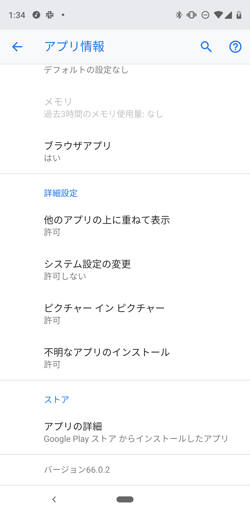

# App Centerからのアプリ配布

App Centerでは、ビルドしたアプリケーションを、テストなどの用途で使用するユーザーに対して配布することができます。

App Centerからアプリケーションを配布するには、ビルドが以下の条件を満たしている必要があります。

### Androidアプリケーションの場合

- ビルドがデジタル署名されていること
- 「不明なアプリのインストール」のパーミッションが許可されていること
-  Shared Runtimeを使用したビルドでないこと

### iOSアプリケーションの場合

- ビルドがデジタル署名されていること
- Device Buildであること
- ビルドする際に指定したProvisioning Profileの対象に、アプリケーションをインストールする端末が含まれていること。

## Distribution Group

App Centerからアプリケーションを配布するには、配布時にユーザーを個別に指定するか、
対象のユーザーを含んだグループ(Distribution Group)を作成します。

Distribution Groupを作成するには、メニューの「Distribute」→「Groups」から、[@fig:img_070_100_image]から[@fig:img_070_110_image]の画面を経てグループを作成します。

{#fig:img_070_100_image}

{#fig:img_070_110_image}


ビルドしたアプリケーションをDistribution Groupに配布するには、
ビルドの結果画面から、[@fig:img_070_120_image]から[@fig:img_070_160_image]の画面をたどってアプリケーションを配布します。

{#fig:img_070_120_image}

{#fig:img_070_130_image}

{#fig:img_070_140_image}

{#fig:img_070_150_image}

{#fig:img_070_160_image}

アプリケーションを配布すると、対象のユーザーのアカウントに[@fig:img_070_170_image] の通りのメールが送信されます。
メール中のリンクからApp Centerのダウンロード画面にアクセスし、アプリケーションをダウンロードしてインストールします。

{#fig:img_070_170_image}

iOSアプリケーションの場合は、初回インストール時に、[@fig:img_070_180_image] から[@fig:img_070_200_image]のように、端末に対しプロファイルのインストールが指示されますので、プロファイルの内容を確認し、端末のパスコードを入力してインストールを行います。

{#fig:img_070_180_image}

{#fig:img_070_190_image}

{#fig:img_070_200_image}

なお、App Centerのビルドの設定の「Distribute Build」の設定([@fig:img_070_210_image])を有効にすると、
対象のブランチのビルドが成功するごとに、自動でアプリケーションを配布することができます。

{#fig:img_070_210_image}


## アプリ内のパーミッション許可

Android8.0(Oreo)から、Play Storeを経由しないで配布されているアプリケーション<span class="footnote">いわゆる野良アプリ</span>のインストールへの許可は、
APKファイルをダウンロードするアプリケーションごとに行うようになりました。

このため、App CenterからAndroidアプリケーションをインストールする場合は、
App Centerにアクセスし、APKファイルをダウンロードするブラウザーに対し、このパーミッションを許可する必要があります。

インストールのパーミッションを許可するには、[@fig:img_070_220_image]から[@fig:img_070_240_image]のように、Androidの設定の「アプリと通知」→該当するブラウザー<span class="footnote">この例ではFirefox</span>→「不明なアプリのインストール」と辿って、設定を行います。

{#fig:img_070_220_image}

{#fig:img_070_230_image}

{#fig:img_070_240_image}

この後述べるアプリ内更新(In-App Update)を使用する場合は、このパーミッションはApp Centerからインストールしたアプリケーションに付与するので、
初回のインストール時に許可した後は、ブラウザーに付与した設定を戻して大丈夫です。

## In-App Update(アプリ内更新)

App Centerには、インストールしたアプリケーションの新しいバージョンが配布された場合に、
アプリケーション内で新しいバージョンに更新を行う機能があります。この機能を
In-App Updateと呼びます。

In-App Updateの機能を使用するには、アプリケーションのビルドが以下の条件を満たしている必要があります。

- ビルドバージョンが更新されていること
- Microsoft.AppCenter.Distributeが組み込まれていること
- Debugビルドでないこと<span class="footnote">App Centerのドキュメントでは「Releaseビルドであること」となっていますが、Releaseビルドの設定を元に新しい構成を作成した場合もIn-App Updateは適用されます。</span>
- iOSアプリケーションの場合は、`Info.plist`にApp Centerのアプリケーションのシークレットが設定されていること(後述)
- アプリケーションが、配布した際の通知メール中のリンク先のページからダウンロードされていること

なお、Google Play(Android)ならびにApp Store(iOS)からインストールしたアプリケーションの場合は、In-App Updateの機能は無効になります。

## iOSアプリケーションのシークレットの設定

iOSアプリケーションでIn-App Updateの機能を有効にするには、`Info.plist`に[@lst:code_075_010]の様にApp Centerのアプリケーションのシークレットを設定する必要があります。

```{#lst:code_075_010 caption="git statusの状態"}
  <array>
      <dict>
          <key>CFBundleURLSchemes</key>
          <array>
              <string>appcenter-(AppCenterのiOSアプリケーションのシークレット)</string>
          </array>
      </dict>
  </array>
```  

## ビルドバージョン

In-App Updateは、新しいビルドが行われた時に、以下の手順でアプリケーションが更新されたと判断します。<span class="footnote">[https://docs.microsoft.com/en-us/appcenter/distribution/inappupdates](https://docs.microsoft.com/en-us/appcenter/distribution/inappupdates)</span>

- Androidアプリケーションの場合は、`AndroidManifest.xml`で`versionCode`ないし`versionName`がインクリメントされていること。
- iOSアプリケーションの場合は、`Info.plist`で`CFBundleShortVersionString`ないし`CFBundleVersion`がインクリメントされていること。

App Centerでは、[@fig:img_070_250_image]のように、ビルドの設定の「Automatically increment version code」の
チェックを有効にすることで、ビルド時にこれらのバージョンを自動でインクリメントすることができます。

{#fig:img_070_250_image}

## ダウンロード先

In-App Updateの対象となるのは、配布した際の通知メール中のリンク先のページ(`install.appcenter.ms`ドメイン)です。App Centerではメニューの「Distribute」→「Releases」の各リリース画面からもアプリケーションをダウンロードしたインストールすることができますが、この場合は[@fig:img_070_260_image]のダイアログが出てIn-App Updateは無効になります。

{#fig:img_070_260_image}

## In-App Updateの挙動

In-App Updateが組み込まれているアプリケーションをインストールすると、初回の起動時にアプリケーション内でブラウザーが開き、App Centerにアクセスします。

この際、アプリケーション内に組み込まれているアプリケーションのシークレットを使って
App Centerに認証を行い、認証が有効だった場合にIn-App Updateが有効になります。

In-App Updateが有効な状態で新しいバージョンのアプリケーションがリリースされると、[@fig:img_070_270_image]ならびに[@fig:img_070_280_image]の通りアプリケーション内でダウンロードのポップアップが開きます。ポップアップの指示に従ってダウンロードすると、新しいバージョンのアプリケーションをダウンロードしてインストールします。

{#fig:img_070_270_image}

{#fig:img_070_280_image}


先述の通り、Android8.0(Oreo)から、Play Storeを経由しないで配布されているアプリケーションのインストールへの許可は、
APKファイルをダウンロードするアプリケーションごとに行うようになっています。

このため、AndroidアプリケーションでIn-App Updateを有効にするには、そのアプリケーションの「不明なアプリのインストール」のパーミッションを許可する必要があります。

{#fig:img_070_290_image}
