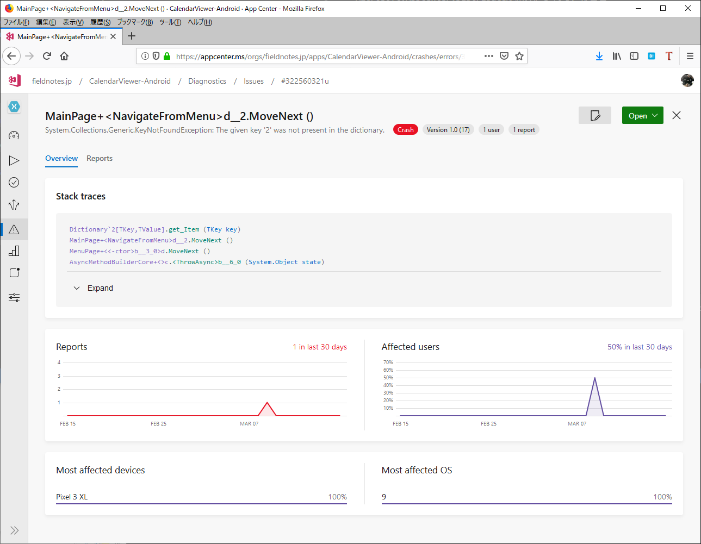
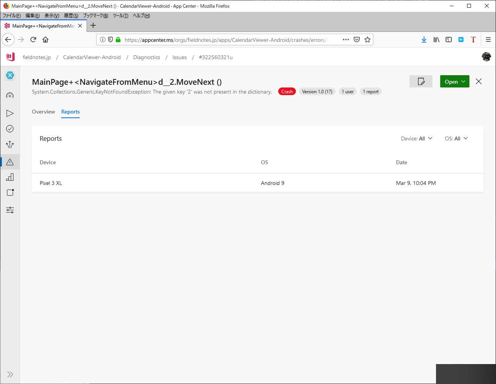

# Diagonstics

Diagonsticsは、日本語に訳すと「診断」という意味ですが、AppCenterでは、
アプリケーションのクラッシュならびにエラー発生の情報を収集することができます。


## Crash Report

アプリケーション上で、意図的にクラッシュを起こすためのクラスとして、
`Microsoft.AppCenter.Crashes`クラスに`GenerateTestCrash`というメソッドを呼び出しますが、

```
MenuItemType id = ((HomeMenuItem)e.SelectedItem).Id;
if (id == MenuItemType.Crash)
{
    Crashes.GenerateTestCrash();
}
```

{#fig:img_080_100_image}

{#fig:img_080_200_image}

## エラーレポート

アプリケーション内で発生したエラーを補足するには、
例外を補足した処理内で、
`Microsoft.AppCenter.Crashes`クラスの`TraceError`メソッドを呼び出します。

```
try
{
    string value = null;
    value.Substring(0, 1);
}
catch(Exception ex)
{
    Crashes.TrackError(ex, new Dictionary<string, string> { { "message", "ぬるぽ" } });
    return;
}
```


## 実機での起動テスト(Test on real device)

App CenterのDiagonsticsで収集できるエラー及びクラッシュは、アプリケーションの起動処理で`AppCenter`クラスの`Start`メソッドが呼び出され、
AppCenterのSDKが起動した後に発生するエラーです。

これより前に発生するエラーは、AppCenterでは収集することができません。

AppCenterでは、ビルド実行時に、AppCenterのデバイスファーム上での
実機を使って、アプリケーションでの起動をテストすることができます。

実機での起動テストを行うには、以下の条件が必要です。

- Releaseビルドであること
- 共有ランタイムを使用していないこと(Androidアプリケーションの場合)
- APKファイルないしIPAファイルにデジタル署名がされていること
