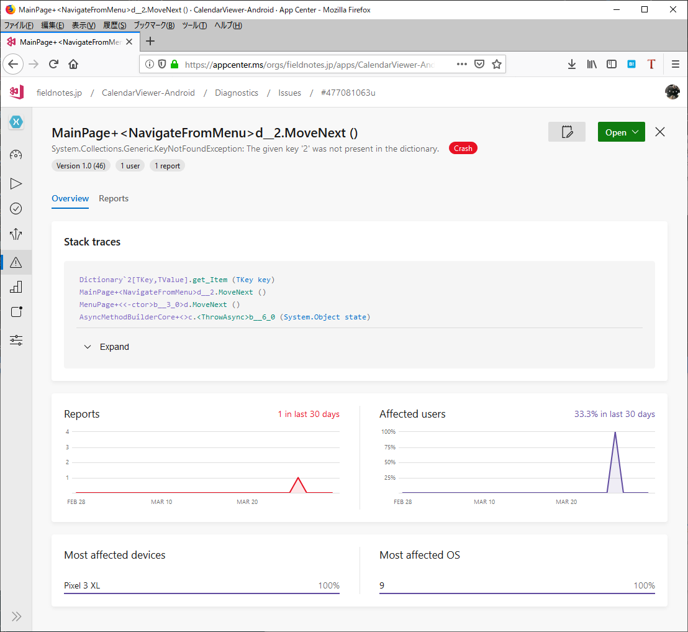
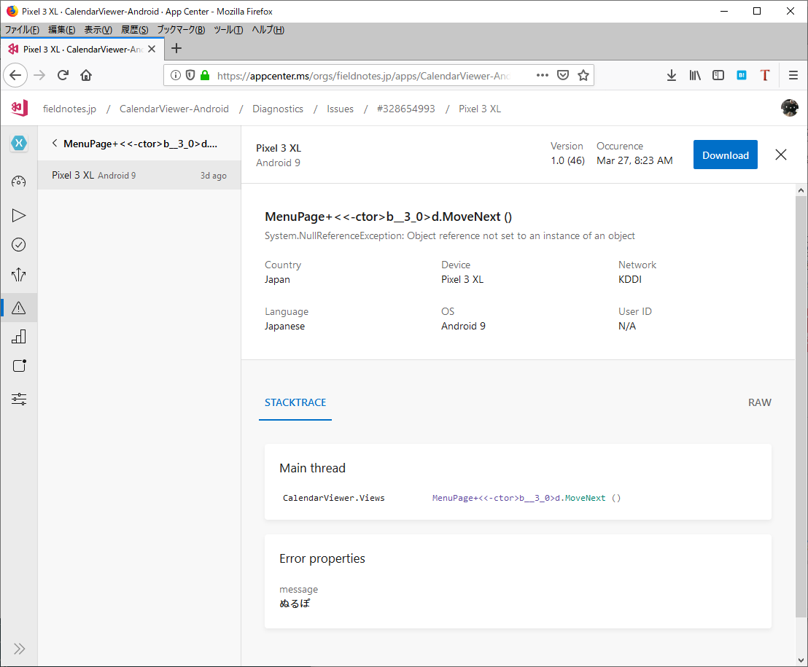
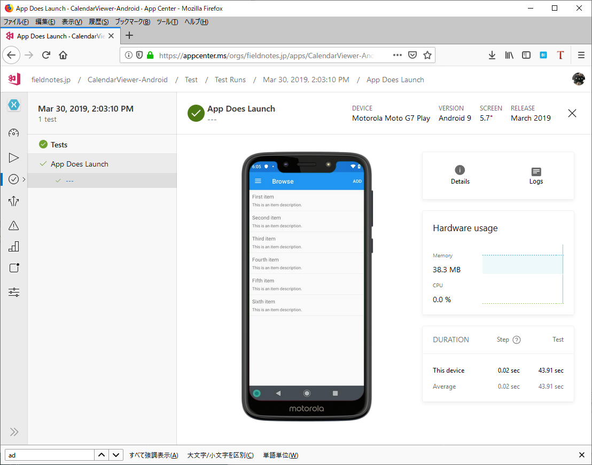

# Diagonstics

Diagonsticsは、日本語に訳すと「診断」という意味ですが、AppCenterでは、
アプリケーションのクラッシュならびにエラー発生の情報を収集することができます。

## Crash Report

アプリケーション上で、意図的にクラッシュを起こすためのクラスとして、
`Microsoft.AppCenter.Crashes`クラスに`GenerateTestCrash`というメソッドを呼び出しますが、この機能は、ビルドが「Debug」の構成の場合のみ有効です。

```
MenuItemType id = ((HomeMenuItem)e.SelectedItem).Id;
if (id == MenuItemType.Crash)
{
    Crashes.GenerateTestCrash();
}
```

次のコードでは"Bomb"のメニューに対する画面遷移を定義していないため、
メニュー選択時にクラッシュするようになっていますが、
アプリケーションを実行してクラッシュさせると、以下の様なレコードが
送られます。

```
        public MenuPage()
        {
            InitializeComponent();

            menuItems = new List<HomeMenuItem>
            {
                new HomeMenuItem {Id = MenuItemType.Browse, Title="Browse" },
                new HomeMenuItem {Id = MenuItemType.About, Title="About" },
                new HomeMenuItem {Id = MenuItemType.Crash, Title="Bomb" },
                new HomeMenuItem {Id = MenuItemType.Error, Title="Error" }
            };

            ListViewMenu.ItemsSource = menuItems;

            ListViewMenu.SelectedItem = menuItems[0];
            ListViewMenu.ItemSelected += async (sender, e) =>
            {
                if (e.SelectedItem == null)
                    return;
                MenuItemType id = ((HomeMenuItem)e.SelectedItem).Id;
                (略)
                await RootPage.NavigateFromMenu((int)id);
            };
        }
    }
```
[@fig:img_080_100_image][@fig:img_080_400_image][@fig:img_080_200_image] は、アプリケーションがクラッシュした際のレポートの画面です。

{#fig:img_080_100_image}

{#fig:img_080_400_image}

{#fig:img_080_200_image}

## エラーレポート

アプリケーション内で発生したエラーを補足するには、
例外を補足した処理内で、
`Microsoft.AppCenter.Crashes`クラスの`TrackError`メソッドを呼び出します。

```
try
{
    string value = null;
    value.Substring(0, 1);
}
catch(Exception ex)
{
    Crashes.TrackError(ex, new Dictionary<string, string> { { "message", "ぬるぽ" } });
    return;
}
```

[@fig:img_080_500_image]は、上記コードのApp Centerでのレポートの画面です。


{#fig:img_080_500_image}

## 実機での起動テスト(Test on real device)

App CenterのDiagonsticsで収集できるエラー及びクラッシュは、アプリケーションの起動処理で`AppCenter`クラスの`Start`メソッドが呼び出され、
AppCenterのSDKが起動した後に発生するエラーです。

これより前に発生するエラーは、AppCenterでは収集することができません。

AppCenterでは、ビルド実行時に、AppCenterのデバイスファーム上での
実機を使って、アプリケーションでの起動をテストすることができます。

実機での起動テストを行うには、以下の条件が必要です。

- Releaseビルドであること
- 共有ランタイムを使用していないこと(Androidアプリケーションの場合)
- APKファイルないしIPAファイルにデジタル署名がされていること

実機でのテストを行うには、ビルドの設定の「Test on a real device」の
設定を有効にします。

実機のテストは、Microsoftが運用するデバイスファーム上から、任意のデバイスが
選ばれて実行されます。

[@#fig:img_080_300_image]は、App Centerの画面から確認できる、起動テストの結果画面です。

{#fig:img_080_300_image}


